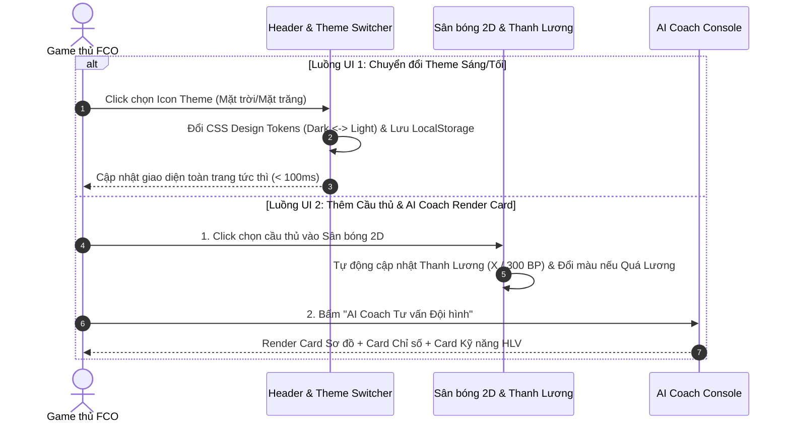

# TÀI LIỆU YÊU CẦU NGHIỆP VỤ (BRD) v1.0.0 - FCO META TACTICS & AI SOLUTION ENGINE

| Thông tin        | Chi tiết                 |
| :--------------- | :----------------------- |
| **Dự án**        | FCO Meta Tactics & AI Solution Engine |
| **Phiên bản**    | **1.0.0 (MVP OFFICIAL)** |
| **Ngày cập nhật**| 24/07/2026               |
| **Trạng thái**   | APPROVED / VERSION 1.0.0 ARCHIVED |
| **Tác giả**      | Senior Business Analyst (BA) & Project Manager (PM) |

---

## LỊCH SỬ THAY ĐỔI

| Version | Ngày | Người sửa | Mô tả thay đổi |
| :--- | :--- | :--- | :--- |
| 1.0.0 | 24/07/2026 | Senior BA & PM | Phiên bản hoàn chỉnh v1.0.0 (APPROVED): Tích hợp Vision, Personas, Use Cases, Lương trần FCO 300+, Dynamic Salary Cap, Real-time AI Auto-Grounding, Dual Theme (Dark/Light Mode), Frontend UI/UX Business Rules, System Telemetry KPIs & PM Risk/Milestone Matrix. |

---

## 1. TỔNG QUAN DỰ ÁN

Dự án ứng dụng Web hỗ trợ game thủ **FC Online (FCO)** xây dựng đội hình, quản lý squad và tối ưu chiến thuật thông minh nhằm nâng cao hiệu suất thi đấu. Trở thành Nền tảng Trợ lý AI và Tra cứu Chiến thuật Số 1 cho game thủ FCO tại Việt Nam và quốc tế.

- **Mục đích:** Cung cấp trải nghiệm người dùng (UI/UX) linh hoạt giúp người chơi chuyển đổi tùy thích giữa **Dark Mode (Chế độ Tối Gaming)** và **Light Mode (Chế độ Sáng Trang nhã)**, xếp đội hình trên Sân bóng 2D trực quan, theo dõi thanh Lương trần thời gian thực (`300 BP`), tương tác với AI Coach và so sánh cầu thủ side-by-side.
- **Giá trị nghiệp vụ:** 
  - **Trải nghiệm Người dùng Đỉnh cao & Linh hoạt (Dual Theme Support):** Giúp người chơi thoải mái sử dụng trong mọi môi trường ánh sáng (chế độ Tối khi chơi game đêm, chế độ Sáng khi tra cứu ban ngày/ngoài trời).
  - **Trực quan hóa Lương trần:** Nhận biết trạng thái Quá Lương tức thì qua màu sắc cảnh báo (`X / 300 BP`).
  - **Cập nhật Meta thời gian thực (Live Meta Compliance):** Lời khuyên của AI và các bộ chỉ số UI luôn khớp 100% với bản cập nhật mới nhất của NPH (Lương trần 300+, mùa giải mới, quy tắc gameplay mới).
- **Đối tượng người dùng (Personas):** 
  - *Persona 1 - Minh (Rank Pusher - 24 tuổi):* Đá Rank Thách Đấu ban đêm, cần Dark Mode chống mỏi mắt và Copy chiến thuật 1-click.
  - *Persona 2 - Nam (Casual / Newbie - 20 tuổi):* Thích chế độ Light Mode sáng sủa tra cứu ban ngày, Sân bóng 2D dễ dùng.
  - *Persona 3 - Hoàng (Budget Planner - 28 tuổi):* Cần bảng so sánh cầu thủ Side-by-side và bộ lọc ngân sách BP rõ ràng.

---

## 2. VẤN ĐỀ & CƠ HỘI

### Các vấn đề (Problems)
1. **Chỉ có Dark Mode gây khó chịu khi tra cứu môi trường ánh sáng mạnh**: Một số người chơi ưa thích giao diện sáng (Light Mode) hoặc thường tra cứu chiến thuật bằng điện thoại ngoài trời, nếu chỉ có giao diện tối sẽ gây khó nhìn.
2. **Giới hạn Lương (Salary Cap) thay đổi liên tục khiến dữ liệu cũ bị lỗi thời**: NPH liên tục tăng trần Lương (từ 260 -> **300 hiện tại** -> 305/310 tương lai). Nếu hệ thống hardcode con số cố định, mọi lời khuyên chiến thuật sẽ bị sai lệch và khiến người chơi bị phạt Quá Lương.
3. **Thiếu Giao diện Trực quan hóa Đội hình & So sánh Cầu thủ**: Người chơi không có nơi lưu trữ nhiều phương án đội hình và không có công cụ so sánh trực quan đặc tính cầu thủ theo khoảng ngân sách BP.

### Các cơ hội (Opportunities)
- **Hỗ trợ Dual Theme (Dark Mode & Light Mode Switching)**: Tự động lưu lựa chọn Theme của người dùng vào LocalStorage và hỗ trợ chuyển đổi màu mượt mà.
- **Cấu hình Lương Động & AI Real-Time Grounding**: Quản lý biến Lương trần `CURRENT_SALARY_CAP = 300` động và tự động tiêm bối cảnh Patch mới nhất vào Prompt AI Coach.
- **Sân bóng 2D Interactive & Console AI Coach dạng Card Cấu trúc**: Tách biệt rõ ràng Card Sơ đồ, Card Chỉ số Chiến thuật Đội/Đơn và Card Kỹ năng HLV.

---

## 3. MỤC TIÊU DỰ ÁN

Xác định các mục tiêu có thể đo lường được:

- **Trải nghiệm UI/UX Linh hoạt (Dual Theme Support):** 100% thành phần giao diện hiển thị sắc nét, tương phản tốt trên cả 2 chế độ **Dark Mode** và **Light Mode**.
- **Phản hồi Thị giác Tức thì (Visual Response):** Thanh Lương trần và ma trận Sơ đồ 2D cập nhật lập tức (< 50ms) ngay khi người dùng thêm/xóa cầu thủ; Chuyển đổi Theme Sáng/Tối mượt mượt trong `< 100ms`.
- **Tính chính xác & Cập nhật Thời gian thực (Live Compliance):** Thanh Lương trần hiển thị thời gian thực theo mốc `CURRENT_SALARY_CAP` (mặc định **300 BP/Lương**).

---

## 4. PHẠM VI DỰ ÁN

### 4.1 Trong phạm vi (In Scope)

- **Module 1: Meta Library & 1-Click Copy UI**
  - Danh mục Thẻ (Card) sơ đồ hot meta theo bản Patch mới nhất.
  - Giao diện xem chi tiết thông số Chiến thuật Đội (Sliders/Numbers) và Lệnh Đơn.
  - Nút bấm `1-Click Copy` kèm hiệu ứng Toast Notification.
- **Module 2: AI Coach Console UI (Trợ lý AI Cá nhân hóa)**
  - Giao diện AI Console dạng Chatbox/Console hiện đại.
  - Render kết quả theo 3 Thẻ cấu trúc (*Card Sơ đồ tối ưu*, *Card Chỉ số Chiến thuật Đội/Đơn*, *Card Kỹ năng HLV*).
- **Module 3: Interactive Pitch, Salary Bar & Dual Theme Engine UI**
  - Nút công tắc chuyển đổi `Dual Theme Switcher` (Dark/Light Mode).
  - Sân bóng 2D Tương tác (Interactive 2D Pitch Canvas) 11 vị trí cầu thủ.
  - Thanh đo Lương trần Động `SalaryCounterBar` tự đổi màu Đỏ nhấp nháy khi Quá Lương (`> 300`).
  - Giao diện Quản lý Đội hình Grid (Lưu, Đổi tên, Nhân bản, Xóa).
- **Module 4: Player DB & Side-by-side Comparison UI**
  - Thanh Lọc Cầu thủ Multi-Filter Toolbar (Tên, Vị trí, Mùa giải, Lương, BP).
  - Modal So sánh Đối đầu Side-by-Side 2-3 cầu thủ theo các cột chỉ số song song.

---

### 4.2 Ngoài phạm vi (Out of Scope)
- Ứng dụng Desktop Companion Overlay chạy đè trực tiếp trên màn hình game.
- Giao dịch tự động trong game FCO.

---

## 5. LUỒNG QUY TRÌNH NGHIỆP VỤ

Mô tả luồng quy trình nghiệp vụ và hành trình trải nghiệm người dùng (User Journey):

---

## 6. QUY TẮC NGHIỆP VỤ (BUSINESS RULES)

- **BR-GAME-01 (Giới hạn Lương trần Động):** Tổng Lương 11 cầu thủ không được vượt quá `CURRENT_SALARY_CAP` (hiện tại là **300 BP/Lương**).
- **BR-GAME-02 (Quy tắc Vị trí & Chân thuận):** *ST:* Chân 5-5 hoặc ZD; *CDM:* Chiều cao > 1m80; *LW/RW:* Chân nghịch sút ZD.
- **BR-GAME-03 (Quy tắc Kỹ năng HLV):** Kỹ năng HLV khớp với sơ đồ (Ví dụ: CAM/CF dâng cao -> Kỹ năng HLV *"Thâm nhập vòng cấm"*).
- **BR-SYS-04 (Cơ chế Cấu hình Lương Động):** Biến `CURRENT_SALARY_CAP` được quản lý dưới dạng biến toàn cục hệ thống (mặc định `300`).
- **BR-AI-05 (Cơ chế AI Real-Time Patch Auto-Grounding):** AI Engine luôn tự động được tiêm bối cảnh Patch mới nhất và mức Lương trần `300` trước khi sinh câu trả lời.
- **BR-UI-06 (Quy tắc Quản lý Dual Theme Dark/Light):** Mặc định **Dark Mode**, hỗ trợ công tắc đổi sang **Light Mode** `< 100ms`, lưu trạng thái `theme_preference` vào LocalStorage.
- **BR-UI-07 (Quy tắc Cảnh báo Lương trần trên UI):** Khi tổng Lương > 300, thanh Lương nhấp nháy Đỏ và disable nút "Lưu Đội Hình".
- **BR-UI-08 (Quy tắc Hiển thị Card Kết quả AI Coach):** Kết quả phân tách thành 3 khối Thẻ riêng biệt: *Card Sơ đồ*, *Card Chỉ số*, *Card Kỹ năng HLV*.
- **BR-UI-09 (Quy tắc Phản hồi Tức thì Visual Feedback):** Thao tác trên Sân bóng 2D phản hồi `< 50ms`; Copy Mã Chiến Thuật hiển thị Toast Notification trong 2 giây.
- **BR-SQUAD-10 (Ràng buộc Quản lý Đội hình UI):** Giới hạn lưu tối đa 10 đội hình trên LocalStorage.

---

## 7. YÊU CẦU CHỨC NĂNG (FUNCTIONAL REQUIREMENTS)

| ID | Nhóm Tính Năng | Mô tả |
| :--- | :--- | :--- |
| **F-01** | Meta Library UI | Xem danh mục Thẻ sơ đồ hot meta chuẩn FCO và 1-Click Copy kèm Toast Notification. |
| **F-02** | AI Coach Console UI | Giao diện Console tư vấn theo Lương 300+ -> Render các Thẻ cấu trúc (Sơ đồ, Chiến thuật, Kỹ năng HLV). |
| **F-03** | Sân bóng 2D & Thanh Lương | Sân cỏ 2D hiển thị 11 vị trí cầu thủ và Thanh đo Lương trần tự đổi màu Đỏ khi Quá Lương (`> 300 BP`). |
| **F-04** | Dual Theme Switcher | Nút công tắc chuyển đổi mượt mà giữa Dark Mode (Tối) và Light Mode (Sáng), lưu LocalStorage. |
| **F-05** | Squad Management | Danh sách Thẻ đội hình cá nhân với đầy đủ các nút bấm: Lưu, Đổi tên, Nhân bản bản sao, Xóa. |
| **F-06** | Player DB & Comparison | Bộ lọc cầu thủ đa tiêu chí và Cửa sổ Modal so sánh đối đầu 2-3 cầu thủ Side-by-Side theo cột song song. |

---

## 8. YÊU CẦU PHI CHỨC NĂNG (NON-FUNCTIONAL REQUIREMENTS)

- **Hiệu năng:** Tốc độ chuyển đổi Theme Sáng/Tối < 100ms; Tốc độ render Sân bóng 2D < 50ms (60fps); Latency AI Coach < 3.0s; Latency mở Modal so sánh < 300ms.
- **Độ sẵn sàng:** Ứng dụng Web tĩnh vận hành ổn định 99.9% trên các hạ tầng hosting Vercel/Netlify.
- **Khả năng mở rộng & Bảo mật:** Biến Cấu hình Lương Động sẵn sàng nâng trần Lương; API Key của AI Engine được bảo mật an toàn.
- **Lưu trữ:** Lưu trữ Cài đặt Theme & Bộ đội hình cá nhân trực tiếp tại LocalStorage của người dùng.

---

## 9. CHỈ SỐ THÀNH CÔNG (SUCCESS METRICS)

Tài liệu này đo lường sự thành công bằng các chỉ số System Telemetry KPIs định lượng:

| Mã KPI | Tên Chỉ số KPI | Mục tiêu Đo lường | Phương pháp Đo lường từ Hệ thống |
| :--- | :--- | :--- | :--- |
| **KPI-01** | AI Coach Adoption Rate | **>= 70%** | Tỷ lệ session có kích hoạt "AI Coach tư vấn (Lương 300+)". |
| **KPI-02** | Tactical Copy Rate | **>= 65%** | Tỷ lệ số lần bấm nút "Copy Bộ Chiến Thuật". |
| **KPI-03** | Salary Compliance Rate | **100%** | 100% lời khuyên AI Coach và đội hình tuân thủ `<= 300`. |
| **KPI-04** | Meta Patch Sync Latency | **< 24 giờ** | Thời gian đồng bộ tri thức Patch mới nhất vào AI Knowledge Store. |
| **KPI-05** | UI Visual Response Latency | **< 50 ms** | Thời gian cập nhật trạng thái Sân 2D và Thanh Lương trần. |
| **KPI-06** | Theme Switch Latency | **< 100 ms** | Thời gian chuyển đổi giữa Dark Mode và Light Mode. |

---

## 10. GHI CHÚ

- Tài liệu BRD này là bản đặc tả nghiệp vụ v1.0.0 (APPROVED) chính thức duy nhất của Version 1.0.0.

---

END OF BRD DOCUMENT v1.0.0
