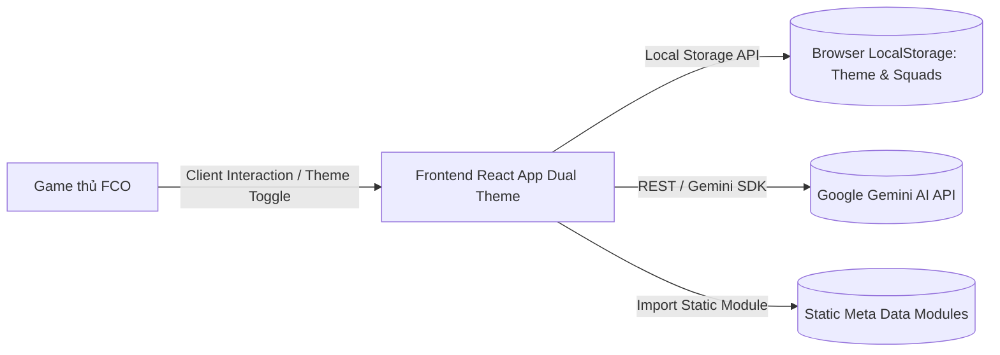
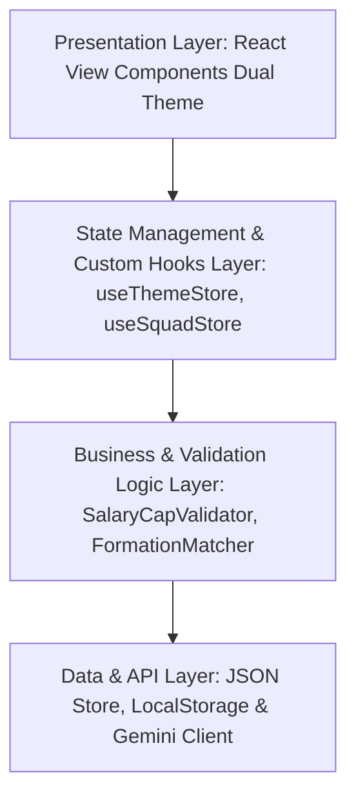
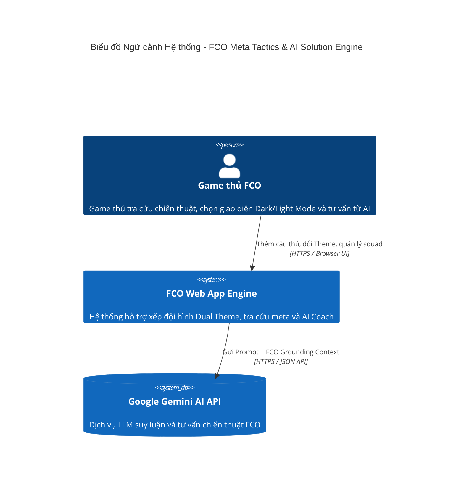
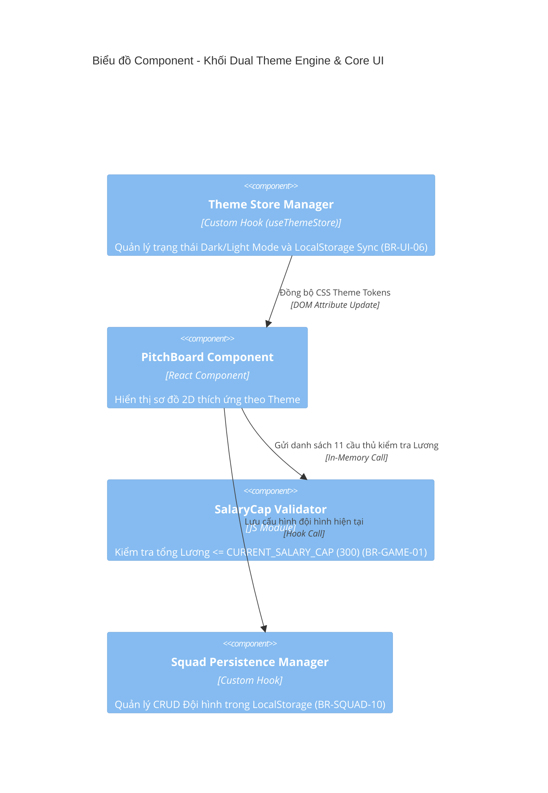

# TÀI LIỆU KIẾN TRÚC HỆ THỐNG (SAD) v1.0.0 - FCO META TACTICS & AI SOLUTION ENGINE

| Thông tin         | Chi tiết         |
| :---------------- | :--------------- |
| **Dự án**         | FCO Meta Tactics & AI Solution Engine |
| **Phiên bản**     | **1.0.0 (MVP OFFICIAL)** |
| **Ngày cập nhật** | 24/07/2026       |
| **Trạng thái**    | APPROVED / VERSION 1.0.0 ARCHIVED |
| **Tác giả**       | Senior System Architect & FE Lead |

---

## NHẬT KÝ THAY ĐỔI

| Version     | Ngày     | Người sửa  | Mô tả thay đổi       |
| :---------- | :------- | :--------- | :------------------- |
| 1.0.0 | 24/07/2026 | Senior Architect & FE Lead | **Phiên bản hoàn chỉnh SAD v1.0.0 (APPROVED)**: Tích hợp đầy đủ Kiến trúc Frontend Chi tiết, State Management, Dual Theme Engine (Dark & Light Mode), Dynamic Salary Cap Engine (300+), Real-Time AI Auto-Grounding & Biểu đồ C4 Model |

---

## 1. Tổng quan và Mục tiêu (v1.0.0)

Tài liệu Kiến trúc Hệ thống (SAD v1.0.0) mô tả thiết kế kiến trúc kỹ thuật chi tiết cho phiên bản MVP.

### 1.1 Mục tiêu Kiến trúc Chính
- **Kiến trúc Frontend Hiện đại & Hỗ trợ Dual Theme (Dark & Light Mode):** Xây dựng giao diện Single Page Application (SPA) trên nền React.js / Vite hỗ trợ chuyển đổi màu sắc mượt mà giữa **Dark Mode (Default)** và **Light Mode (Clean Sports Theme)** với thời gian phản hồi `< 100ms`, đạt hiệu năng 60fps trên Desktop & Mobile.
- **Kiến trúc Cấu hình Lương Động (`CURRENT_SALARY_CAP = 300`):** Thiết kế thanh đo Lương trần trực quan (tự động nhấp nháy Đỏ khi Quá Lương) và bộ tính toán Client-side linh hoạt, sẵn sàng thích ứng khi NPH nâng Lương trần lên 305, 310... trong tương lai.
- **Tối ưu hóa Latency AI & Client Engine:** Tích hợp AI Coach Engine qua Gemini API (P95 Latency < 3.0s) kết hợp bộ tìm kiếm/so sánh cầu thủ Side-by-side Client-side siêu tốc (< 300ms).

### 1.2 Bảng Ma trận Truy vết Kiến trúc từ BRD sang SAD (BRD-to-SAD Traceability Matrix)
| Mã Yêu cầu / Rule BRD | Nội dung Yêu cầu Nghiệp vụ trong BRD v1.0.0 | Thành phần Kỹ thuật Giải quyết trong SAD v1.0.0 |
| :--- | :--- | :--- |
| **BR-GAME-01 / BR-SYS-04** | Lương trần hiện tại 300, Cơ chế Cấu hình Lương Động | `Dynamic System Config Engine` & Module `SalaryCapValidator` (`CURRENT_SALARY_CAP = 300`). |
| **BR-AI-05** | Cơ chế AI Real-Time Patch Auto-Grounding | Module `Prompt Grounding Injector` tự động tiêm bối cảnh Patch & Lương 300 vào Gemini API Prompt. |
| **BR-AI-06** | Thuật toán điểm tương thích Sơ đồ (`Compatibility_Score`) | Business Module `FormationMatcher` (`Score = 0.5*Pos + 0.3*Traits + 0.2*Foot`). |
| **BR-UI-06** | Hỗ trợ Dual Theme (Dark Mode & Light Mode) | Custom Hook `useThemeStore` & Dynamic CSS Variables Tokens System (`[data-theme="dark/light"]`). |
| **BR-UI-07** | Thanh đo Lương trần tự nhấp nháy Đỏ khi Quá Lương | Component `SalaryCounterBar.jsx` với logic kiểm tra `Sum(Salary) > CURRENT_SALARY_CAP`. |
| **BR-UI-08** | Console AI Coach render 3 Card cấu trúc | Component `AIResponseFormatter.jsx` render Header Card, Tactic Card & Manager Skill Card. |
| **BR-UI-09** | Phản hồi Visual `< 50ms`, Toast Copy Notification 2s | `React.memo` cho Sân bóng 2D, Toast Notification Service trong `OneClickCopyBtn.jsx`. |
| **BR-SQUAD-10** | Quản lý Đội hình cá nhân (lưu tối đa 10 đội hình) | Service `Squad Persistence Manager` kết hợp Browser LocalStorage API. |
| **FR-PLAYER-02** | Bảng so sánh 2-3 cầu thủ đối đầu Side-by-side | Component `PlayerCompareModal.jsx` render ma trận chỉ số theo cột song song. |
| **KPI-01 -> KPI-06** | 6 Chỉ số System Telemetry KPIs đo lường | Module `Client Telemetry Event Collector` đo Latency P95, Adoption Rate & Compliance Rate. |

---

## 2. Ràng buộc Kiến trúc

- **Frontend Framework:** React.js 18+ với Vite Build Tool (Single Page Application - SPA) giúp đóng gói production bundle tối ưu.
- **State Management:** React Context API + Custom Reactive Hooks (`useSquadStore`, `useAICoach`, `usePlayerDB`, `useThemeStore`).
- **Styling & Theme Engine:** Dynamic CSS Variables Tokens System (`[data-theme="dark"]` và `[data-theme="light"]`) hỗ trợ chuyển màu mượt mượt trong `< 100ms`.
- **Client-Side Routing:** Hash Router / Tab-based Router siêu nhẹ, đảm bảo chuyển tab không reload trang.
- **Lưu trữ dữ liệu:** Client-Side LocalStorage / SessionStorage Persistence (Lưu trữ `theme_preference`, `squad_list` tối đa 10 đội hình) + Static JSON Modules (`data/formations.json`, `data/meta_tactics.json`, `data/players.json`).
- **Hạ tầng (Infrastructure):** Vercel / Netlify Edge Network + Google Gemini AI API (Model Gemini Flash).
- **Logging & Telemetry:** In-App Performance Telemetry Collector ghi nhận P95 Latency (AI < 3.0s, Search < 300ms, Visual < 50ms) và theo dõi tỷ lệ tương tác UI.

---

## 3. Bối cảnh và Phạm vi

Hệ thống đóng vai trò cầu nối giữa **Game thủ FC Online**, **Cơ sở dữ liệu Meta/Cầu thủ Client-side** và **Hệ thống AI Engine (Google Gemini API)**.



---

## 4. Kiến trúc Dữ liệu & Lưu trữ

Chiến lược lưu trữ dữ liệu tập trung vào mô hình **Client-Side Data Engine**:
- **Static Meta Data Modules:** Dữ liệu sơ đồ, chiến thuật tĩnh và danh mục cầu thủ được đóng gói dưới dạng JSON modules trong client bundle, giúp truy vấn tức thì với độ trễ < 50ms.
- **Dynamic Config Engine:** Quản lý biến Lương trần hệ thống `CURRENT_SALARY_CAP` (mặc định = 300) trong cấu hình toàn cục (`BR-SYS-04`).
- **User Theme & Squad Persistence:** Lưu cài đặt Theme (`dark` hoặc `light`) và danh sách tối đa 10 đội hình cá nhân trực tiếp tại LocalStorage dưới dạng JSON Schema an toàn (`BR-SQUAD-10`).

---

## 5. Cấu trúc Khối (Building Block View)

### 5.1. Cấu trúc Phân tầng (Layered Architecture)



1. **Presentation Layer (Tầng Giao diện UI):**
   - Áp dụng cấu trúc **Atomic Design Pattern** tương thích cả 2 chế độ màu Sáng và Tối theo `BR-UI-06`:
     - *Atoms:* Badges, Buttons, Sliders, Theme Switcher Toggle (`ThemeSwitcherToggle.jsx`).
     - *Molecules:* Player Cards, Salary Counter Bar (`SalaryCounterBar.jsx` tự báo Đỏ khi > 300 BP theo `BR-UI-07`).
     - *Organisms:* Pitch Board 2D (`PitchBoardView.jsx`), AI Console Panel (`AICoachConsoleView.jsx`), Player Comparison Matrix Modal (`PlayerCompareModal.jsx`).
2. **State Management & Custom Hooks Layer (Tầng Quản lý Trạng thái):**
   - `useThemeStore`: Quản lý trạng thái Theme (`dark` hoặc `light`), đồng bộ biến CSS global và lưu LocalStorage.
   - `useSquadStore`: Quản lý 11 vị trí cầu thủ trên sân, tính tổng Lương, kiểm tra trùng tên và trần Lương 300 BP (`BR-GAME-01`).
   - `useAICoach`: Quản lý luồng tương tác AI Coach và render các Thẻ cấu trúc kết quả (`BR-UI-08`).
   - `usePlayerDB`: Quản lý lọc đa tiêu chí và so sánh side-by-side (`FR-PLAYER-02`).
3. **Business & Validation Logic Layer (Tầng Logic Nghiệp vụ):**
   - `SalaryCapValidator`: Kiểm tra tổng điểm Lương (`Sum(Salary) <= CURRENT_SALARY_CAP`). Báo Đỏ UI khi Quá Lương.
   - `FormationMatcher`: Thuật toán tính ma trận điểm tương thích `Compatibility_Score = (0.5 * Pos) + (0.3 * Traits) + (0.2 * Foot)` theo `BR-AI-06`.
   - `CodeExporter`: Format bộ chỉ số chiến thuật thành chuỗi Markdown copy 1-click kèm Toast Notification (`BR-UI-09`).
4. **Data Access & Integration Layer (Tầng Tích hợp Dữ liệu):**
   - `LocalStorageService`, `JSONDataLoader`, `GeminiApiClient`.

### 5.2. Phân rã Module chi tiết

- **Module 1: Meta Library Module:** Quản lý danh mục sơ đồ tĩnh, chiến thuật đội/đơn và dịch vụ Copy 1-Click.
- **Module 2: AI Coach Engine Module:** Trực tiếp đóng gói ma trận cầu thủ đầu vào, gọi Gemini API để sinh trọn bộ Sơ đồ + Chiến thuật + Kỹ năng HLV.
- **Module 3: Squad Management Module:** Xử lý các thao tác CRUD đội hình cá nhân (Save, Rename, Duplicate, Delete).
- **Module 4: Player DB & Comparison Module:** Xử lý bộ lọc cầu thủ đa tiêu chí và thuật toán so sánh chỉ số side-by-side.
- **Module 5: Dynamic System Config Module:** Quản lý biến cấu hình Lương trần toàn cục (`CURRENT_SALARY_CAP = 300`).

---

## 6. Các khía cạnh phi chức năng

### 6.1 Chiến lược Caching
- **L1 Cache (In-Memory):** Cache danh sách cầu thủ và sơ đồ trong React State/RAM.
- **L2 Cache (Browser LocalStorage):** Lưu danh sách Squad cá nhân, Cấu hình Lương trần `CURRENT_SALARY_CAP` và `theme_preference` (`dark` hoặc `light`).
- **AI Response Cache:** Cache kết quả chẩn đoán AI cho các bộ khung cầu thủ trùng khớp trong Session.

### 6.2 Logging & Monitoring
- Ghi nhận telemetry P95 Latency (AI < 3.0s, Visual < 50ms, Theme Switch < 100ms).
- Đo lường các chỉ số KPIs: `KPI-01` Adoption Rate, `KPI-02` Copy Rate, `KPI-03` Salary Compliance 100%.

### 6.3 Quản lý Cấu hình (Configuration Management)
- Biến Môi trường: `VITE_GEMINI_API_KEY` bảo mật trong môi trường build.
- Cấu hình Động: Biến `CURRENT_SALARY_CAP = 300` và `DEFAULT_THEME = 'dark'`.

---

## 7. Khung nhìn Thời gian chạy (Runtime View)

### Luồng xử lý Chuyển đổi Theme Sáng/Tối (Light/Dark Mode Runtime View)

1. **[Bước 1]:** Người dùng click nút `ThemeSwitcherToggle` trên Header.
2. **[Bước 2]:** `useThemeStore` nhận sự kiện -> Thay đổi giá trị state sang `light` hoặc `dark`.
3. **[Bước 3]:** Cập nhật thuộc tính HTML: `document.documentElement.setAttribute('data-theme', theme)`.
4. **[Bước 4]:** Trình duyệt tự động áp dụng tập biến CSS Variables mới qua hiệu ứng transition mượt mượt `< 100ms`.
5. **[Bước 5]:** Lưu trạng thái mới vào LocalStorage (`theme_preference`).

---

## 8. Khung nhìn Triển khai (Deployment View)

- **[Đóng gói - Packaging]:** Đóng gói ứng dụng Single Page Application tĩnh qua công cụ `Vite Build` (`npm run build`).
- **[Containerization / Hosting]:** Triển khai trên Vercel / Netlify Edge Network.
- **[Scripts chạy ứng dụng]:** 
  - `npm run dev`: Chạy môi trường thử nghiệm địa phương (Port 5173).
  - `npm run build`: Đóng gói production bundle vào thư mục `dist/`.
  - `npm run preview`: Kiểm tra trước bản build production.

---

## Biểu đồ Mô hình C4 (C4 Model Diagrams)

### Cấp độ 1: System Context Diagram (Biểu đồ Ngữ cảnh Hệ thống)



### Cấp độ 2: Container Diagram (Biểu đồ Container)

```mermaid
C4Container
    title Biểu đồ Container - FCO Meta Tactics & AI Solution Engine

    Container(spa, "Single Page Web App", "React.js, Vite, Dynamic CSS Tokens", "Cung cấp giao diện tương tác Dark & Light Mode Modern Gaming")
    ContainerDb(localData, "Static Data Modules", "JSON Store", "Lưu trữ dữ liệu Sơ đồ, Chiến thuật Meta và Cầu thủ")
    ContainerDb(storage, "Browser LocalStorage", "HTML5 Web Storage", "Lưu trữ Squads cá nhân, Config Lương 300 và Theme Preference")
    Container(aiService, "AI Engine Client Service", "JavaScript / Gemini SDK", "Đóng gói Prompt và giao tiếp với AI Backend")

    Rel(spa, localData, "Đọc dữ liệu sơ đồ & cầu thủ", "JS Import")
    Rel(spa, storage, "Lưu & đọc Squads và Theme Preference", "Web Storage API")
    Rel(spa, aiService, "Yêu cầu tư vấn AI", "Function Call")
    Rel(aiService, gemini, "Gọi mô hình Gemini Flash", "REST / HTTPS")
```

### Cấp độ 3: Component Diagram (Biểu đồ Component - Tập trung vào Dual Theme & Core UI)



---

END OF SAD DOCUMENT v1.0.0
