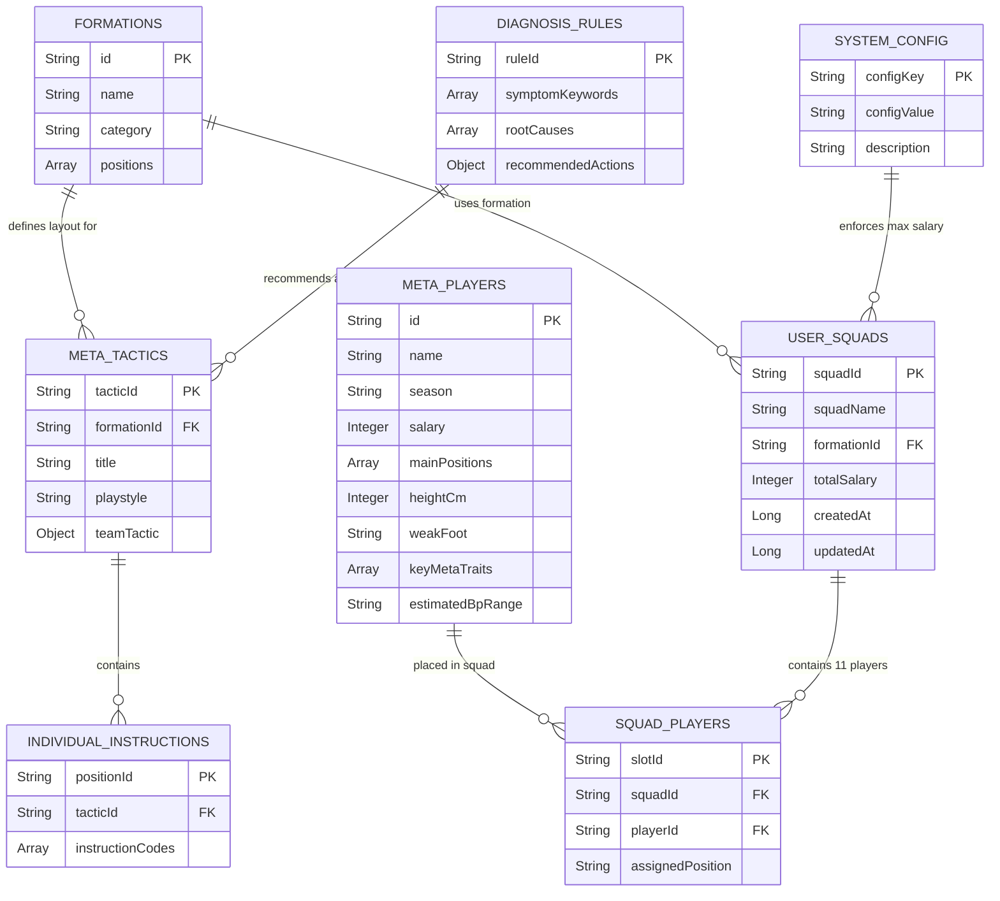

# TÀI LIỆU THIẾT KẾ CƠ SỞ DỮ LIỆU (DBD) v1.0.0 - FCO META TACTICS & AI SOLUTION ENGINE

| Thông tin         | Chi tiết                 |
| :---------------- | :----------------------- |
| **Dự án**         | FCO Meta Tactics & AI Solution Engine |
| **Phiên bản**     | **1.0.0 (MVP OFFICIAL)** |
| **Ngày cập nhật** | 24/07/2026               |
| **Trạng thái**    | APPROVED / VERSION 1.0.0 ARCHIVED |
| **Tác giả**       | Senior Data Architect & BA |
| **Cơ sở dữ liệu** | Client-Side Static JSON Store & HTML5 LocalStorage Persistence |

---

## NHẬT KÝ THAY ĐỔI

| Version | Ngày | Người sửa | Mô tả thay đổi |
| :--- | :--- | :--- | :--- |
| 1.0.0 | 24/07/2026 | Senior Data Architect | **Phiên bản hoàn chỉnh DBD v1.0.0 (APPROVED)**: Khởi tạo Sơ đồ ERD, định nghĩa các bảng dữ liệu Client-Side JSON Modules, LocalStorage Schemas & Quy tắc Chỉ mục Indexing dựa trên BRD v1.0.0 và SAD v1.0.0 đã phê duyệt |

---

## 1. SƠ ĐỒ THỰC THỂ KẾT HỢP (ERD)

Sơ đồ ERD (Entity Relationship Diagram) mô tả các thực thể dữ liệu chính trong hệ thống FCO Meta Tactics & AI Solution Engine và mối quan hệ giữa chúng.

---

## 2. CHI TIẾT BẢNG DỮ LIỆU (TABLE DEFINITIONS)

### 2.1. `FORMATIONS` (Sơ đồ Chiến thuật & Tọa độ 2D Sân bóng)
Bảng lưu trữ định nghĩa các sơ đồ bóng đá FCO và tọa độ hiển thị vị trí trên Sân 2D Grid Canvas (`data/formations.json`).

- `id` (String, PK): Định danh duy nhất của sơ đồ (Ví dụ: `"4-2-3-1"`, `"4-1-2-3"`, `"5-2-3"`).
- `name` (String): Tên sơ đồ hiển thị (Ví dụ: `"4-2-3-1 Đội hình Quốc Dân"`).
- `category` (String): Phân loại sơ đồ (`"Balanced"`, `"Attacking"`, `"Defensive"`).
- `positions` (Array of Objects): Danh sách 11 vị trí trên sân 2D.

### 2.2. `META_TACTICS` (Thông số Chiến thuật Đội & Lệnh Đơn)
Bảng lưu trữ các bộ thông số chiến thuật meta chuẩn FCO từ Top Ranker (`data/meta_tactics.json`).

### 2.3. `META_PLAYERS` (Danh mục Cầu thủ Tra cứu & So sánh)
Bảng lưu danh mục cầu thủ tiêu biểu phục vụ gợi ý và so sánh đối đầu side-by-side (`data/players.json`).

### 2.4. `USER_SQUADS` & `SQUAD_PLAYERS` (Đội hình Cá nhân Lưu trữ LocalStorage)
Bảng quản lý danh sách đội hình do người dùng lưu trữ trong Browser LocalStorage (`key: "fco_user_squads"`).

### 2.5. `SYSTEM_CONFIG` (Cấu hình Lương Động & Theme System)
Bảng quản lý các biến Cấu hình Toàn cục của ứng dụng (`key: "fco_system_config"`).

### 2.6. `DIAGNOSIS_RULES` (Tri thức AI Coach & Auto-Grounding Rules)
Bảng quy tắc tri thức nền phục vụ AI Coach chẩn đoán và tư vấn (`data/diagnosis_rules.json`).

---

## 3. CHỈ MỤC & HIỆU NĂNG (INDEXING & PERFORMANCE)

- **`META_PLAYERS` Indexing Strategy:** In-Memory Hash Map cho tốc độ P95 Latency `< 300ms`.
- **`META_TACTICS` Indexing Strategy:** Map Index theo `formationId` cho độ trễ `< 50ms`.
- **`USER_SQUADS` LocalStorage Constraints:** Lưu tối đa 10 đội hình.

---

END OF DBD DOCUMENT v1.0.0
