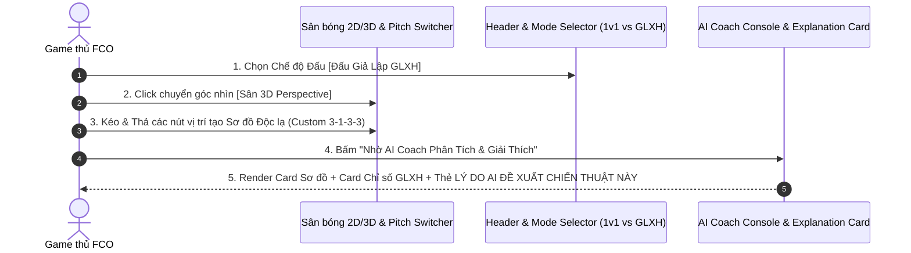

# TÀI LIỆU YÊU CẦU NGHIỆP VỤ (BRD) v2.0.0 - FCO META TACTICS & AI SOLUTION ENGINE

| Thông tin        | Chi tiết                 |
| :--------------- | :----------------------- |
| **Dự án**        | FCO Meta Tactics & AI Solution Engine |
| **Phiên bản**    | **2.0.0 (OFFICIAL RELEASE)** |
| **Ngày cập nhật**| 24/07/2026               |
| **Trạng thái**   | APPROVED / READY FOR FE-BE DEVELOPMENT |
| **Tác giả**      | Senior Business Analyst (BA) & Project Manager (PM) |

---

## LỊCH SỬ THAY ĐỔI

| Version | Ngày | Người sửa | Mô tả thay đổi |
| :--- | :--- | :--- | :--- |
| 1.0.0 | 24/07/2026 | Senior BA & PM | Phiên bản MVP v1.0.0 (APPROVED): Tích hợp Vision, Personas, Use Cases, Lương trần FCO 300+, Dynamic Salary Cap, Real-time AI Auto-Grounding, Dual Theme (Dark/Light Mode), Frontend UI/UX Business Rules, System Telemetry KPIs & PM Risk/Milestone Matrix. |
| 2.0.0 | 24/07/2026 | Senior BA & PM | **Nâng cấp v2.0.0 (APPROVED)**: Tích hợp Dữ liệu FIFAAddict (`vn.fifaaddict.com`), Kéo thả vị trí tạo Sơ đồ Độc lạ, Chuyển đổi Sân bóng 2D/3D, Chế độ Đấu 1v1 vs Giả Lập GLXH & AI Engine Giải thích Lý do Chiến thuật. **Chuẩn hóa nghiệp vụ (Loại bỏ chữ BP trong Lương: 300 BP -> 300)**. |

---

## 1. TỔNG QUAN DỰ ÁN

Dự án ứng dụng Web hỗ trợ game thủ **FC Online (FCO)** xây dựng đội hình, quản lý squad và tối ưu chiến thuật thông minh nhằm nâng cao hiệu suất thi đấu. Trở thành Nền tảng Trợ lý AI và Tra cứu Chiến thuật Số 1 cho game thủ FCO tại Việt Nam và quốc tế.

- **Mục đích (v2.0.0):** Cung cấp giao diện tương tác nâng cao với Sân bóng 2D/3D Perspective Switcher, cho phép người dùng tự do **Kéo & Thả (Drag & Drop)** vị trí cầu thủ trên sân để tạo ra các **Sơ đồ Độc lạ**, kết hợp bộ chọn **Chế độ Đấu (Xếp hạng 1v1 vs Giả lập GLXH)** và AI Coach tự động phân tích + **Giải thích lý do lựa chọn chiến thuật (AI Tactical Rationale Explanation Engine)** dựa trên dữ liệu chuẩn từ FIFAAddict (`vn.fifaaddict.com`).
- **Giá trị nghiệp vụ:** 
  - **Dữ liệu Chuẩn FIFAAddict Live:** Cập nhật liên tục các mùa giải hot mới nhất (`ICON TM`, `24TS`, `EU24`, `CU`, `24UCL`).
  - **Tự do Sáng tạo Sơ đồ Dị:** Cho phép tạo sơ đồ tùy biến và nhận tư vấn chiến thuật cá nhân hóa kèm lời giải thích minh bạch từ AI.
  - **Tối ưu theo Chế độ Đấu:** Phân rã chiến thuật riêng biệt cho chế độ Đá tay 1v1 và Đá Giả Lập GLXH (Manager Simulation).
- **Đối tượng người dùng (Personas v2.0.0):** 
  - *Persona 1 - Minh (Rank Pusher - 24 tuổi):* Cần AI phân tích sơ đồ dị và giải thích tại sao lại dùng bộ chỉ số này khi đá Xếp Hạng 1v1.
  - *Persona 2 - Nam (Manager Gamer - 22 tuổi):* Chuyên cày Giả Lập GLXH, cần AI đẩy cao tốc độ và chỉ số sút xa ZD tự động.
  - *Persona 3 - Hoàng (Visual Enthusiast - 28 tuổi):* Thích trải nghiệm góc nhìn Sân bóng 3D Perspective và kéo thả cầu thủ trực quan.

---

## 2. VẤN ĐỀ & CƠ HỘI

### Các vấn đề (Problems)
1. **Sơ đồ cố định không đáp ứng các bài đá biến tấu/dị của Top Ranker**: Nhiều game thủ muốn tùy biến vị trí cầu thủ lệch sang hành lang cánh hoặc dâng cao bất quy tắc.
2. **AI đưa ra chiến thuật nhưng không giải thích lý do**: Người chơi muốn biết TẠI SAO lại chọn tốc độ 75 hay dạt biên bọc lót thay vì chỉ nhận các con số vô hồn.
3. **Chiến thuật Đá tay 1v1 không áp dụng được cho Đá Giả lập GLXH**: Chế độ Giả lập yêu cầu sút xa ZD và tốc độ đẩy bóng khác hẳn chế độ điều khiển tay 1v1.
4. **Dữ liệu cầu thủ thiếu đồng bộ với nguồn uy tín**: Cần nguồn dữ liệu chuẩn hóa trực tiếp từ `vn.fifaaddict.com`.

### Các cơ hội (Opportunities)
- **Tương tác Sân bóng 2D/3D Drag & Drop**: Kéo thả vị trí cầu thủ tức thì với góc nhìn 3D Perspective bắt mắt.
- **AI Explanation Engine & Mode Switcher**: Tự động giải thích lý do đề xuất và tối ưu riêng cho chế độ [Đấu Xếp Hạng 1v1] hoặc [Đấu Giả Lập GLXH].

---

## 3. MỤC TIÊU DỰ ÁN

- **Cập nhật Dữ liệu Live FIFAAddict:** 100% cầu thủ thuộc các mùa giải mới nhất được đồng bộ thông số chuẩn `vn.fifaaddict.com`.
- **Trải nghiệm Kéo thả & 2D/3D Toggle:** Thao tác kéo thả vị trí phản hồi `< 16ms` (60fps); Chuyển đổi góc nhìn 2D/3D trong `< 50ms`.
- **Minh bạch Tri thức AI (AI Explanation):** 100% tư vấn AI kèm khối giải thích lý do phân tích rõ ràng ưu/nhược điểm tactical.

---

## 4. PHẠM VI DỰ ÁN (v2.0.0)

### 4.1 Trong phạm vi (In Scope)

- **Module 1: Meta Library & FIFAAddict Live Data Store**
  - Cập nhật cầu thủ mùa giải mới nhất từ FIFAAddict (`vn.fifaaddict.com`).
  - Bổ sung nhiều trường phái chiến thuật meta mới (Tiki-taka, Tạt cánh, Counter-Pressing, Catenaccio).
- **Module 2: Enhanced AI Coach Engine & Explanation Card**
  - Khối **AI Tactical Rationale Explanation Card** (Giải thích TẠI SAO dùng chiến thuật này).
  - Phân tích vị trí tự do cho **Sơ đồ Độc lạ**.
  - Bộ chọn **Chế độ Đấu (1v1 Ranked Mode vs Giả Lập GLXH Mode)**.
- **Module 3: Interactive 2D/3D Drag & Drop Pitch Engine**
  - Sân bóng tương tác hỗ trợ Kéo & Thả (Drag & Drop) vị trí cầu thủ tự do.
  - Công tắc chuyển đổi góc nhìn **Sân bóng 2D (Top-down) <-> Sân bóng 3D (Perspective View)**.
  - Thanh đo Lương trần Động `SalaryCounterBar` tự đổi màu Đỏ nhấp nháy khi Quá Lương (`> 300`).
- **Module 4: Player DB & Side-by-side Comparison UI**

### 4.2 Ngoài phạm vi (Out of Scope)
- Ứng dụng Desktop Companion Overlay chạy đè trực tiếp trên màn hình game (Dành cho Phase 3).

---

## 5. LUỒNG QUY TRÌNH NGHIỆP VỤ (v2.0.0)

---

## 6. QUY TẮC NGHIỆP VỤ NÂNG CẤP (BUSINESS RULES v2.0.0)

- **BR-GAME-01 (Lương trần Động):** Tổng Lương 11 cầu thủ không được vượt quá `CURRENT_SALARY_CAP` (`300`).
- **BR-PITCH-11 (Drag & Drop & Custom Formation):** Cho phép kéo thả vị trí cầu thủ tự do trên sân. Tự động tính toán lại vai trò dựa trên tọa độ X/Y (Ví dụ: Y < 20% -> Tiền đạo, Y > 70% -> Hậu vệ).
- **BR-MODE-12 (Quy tắc Chế độ Đấu 1v1 vs Giả Lập):**
  - *Chế độ 1v1 Ranked:* AI tối ưu lối chơi cân bằng, chú trọng thủ chắc và chuyền ban bật.
  - *Chế độ Giả Lập GLXH:* AI đẩy cao Tốc độ lối chơi (+15%), Chuyền dài (+10%) và Tối đa hóa chỉ số Sút xa ZD (+20%).
- **BR-AI-13 (Cơ chế AI Explanation Engine):** Kết quả tư vấn AI bắt buộc chứa phần giải thích lý do (*Tactical Rationale*) với 3 nội dung: Nguyên nhân hình học sơ đồ, Điểm mạnh công/thủ và Lưu ý khi vận hành.
- **BR-DATA-14 (Ràng buộc Dữ liệu FIFAAddict):** Dữ liệu cầu thủ hiển thị đường dẫn liên kết trực tiếp tới bài viết chi tiết tại `vn.fifaaddict.com`.

---

## 7. YÊU CẦU CHỨC NĂNG (FUNCTIONAL REQUIREMENTS v2.0.0)

| ID | Nhóm Tính Năng | Mô tả |
| :--- | :--- | :--- |
| **F-01** | FIFAAddict Live Sync | Đồng bộ danh mục cầu thủ và mùa giải mới nhất từ `vn.fifaaddict.com`. |
| **F-02** | 2D/3D Pitch Switcher | Công tắc chuyển đổi mượt mượt giữa Sân 2D (Top-down) và Sân 3D Perspective. |
| **F-03** | Free Drag & Drop Positioning | Tự do kéo thả vị trí cầu thủ tạo các sơ đồ độc lạ tùy biến. |
| **F-04** | Mode Selector (1v1 vs GLXH) | Bộ chọn chế độ Đấu Xếp Hạng 1v1 vs Đấu Giả Lập GLXH. |
| **F-05** | AI Explanation Card | Thẻ render lời giải thích chi tiết lý do AI đề xuất bộ chiến thuật này. |
| **F-06** | Expanded Tactics Catalog | Bổ sung thêm nhiều biến thể chiến thuật đội/đơn nâng cao. |

---

## 8. YÊU CẦU PHI CHỨC NĂNG (NON-FUNCTIONAL REQUIREMENTS v2.0.0)

- **Hiệu năng:** Thao tác kéo thả vị trí phản hồi `< 16ms` (60fps); Tốc độ chuyển đổi Sân 2D/3D `< 50ms`; Latency AI Coach `< 3.0s`.
- **Độ tương thích:** Chạy mượt mượt trên mọi trình duyệt hiện đại (Chrome, Safari, Firefox, Edge).

---

## 9. CHỈ SỐ THÀNH CÔNG (SUCCESS METRICS v2.0.0)

| Mã KPI | Tên Chỉ số KPI | Mục tiêu Đo lường | Phương pháp Đo lường từ Hệ thống |
| :--- | :--- | :--- | :--- |
| **KPI-01** | Custom Formation Adoption | **>= 60%** | Tỷ lệ session sử dụng tính năng kéo thả vị trí tạo sơ đồ độc lạ. |
| **KPI-02** | Mode Switcher Usage | **>= 50%** | Tỷ lệ người dùng chuyển đổi giữa chế độ 1v1 và Giả lập GLXH. |
| **KPI-03** | 3D Pitch View Toggle Rate | **>= 40%** | Tỷ lệ trải nghiệm ở góc nhìn Sân 3D Perspective. |
| **KPI-04** | AI Explanation Satisfaction | **>= 85%** | Đánh giá hài lòng với lời giải thích lý do chiến thuật của AI. |

---

## 10. MA TRẬN PHÂN CÔNG THỜI GIAN & RỦI RO DỰ ÁN (v2.0.0)

### 10.1 Mốc Thời gian Triển khai (Milestones)
- **Phase 1 (Tuần 1):** Hoàn thiện FIFAAddict Live Sync Adapter & Game Mode Selector UI.
- **Phase 2 (Tuần 2):** Phát triển Drag & Drop 2D/3D Pitch Canvas Engine.
- **Phase 3 (Tuần 3):** Tích hợp AI Tactical Rationale Explanation Engine & UAT Verification.

### 10.2 Quản lý Rủi ro (Risk Mitigation)
- **Rủi ro API AI Quá tải:** Xây dựng Fallback Template offline cho AI Explanation Card.
- **Rủi ro Dữ liệu Mới:** Đồng bộ định kỳ 24h từ dữ liệu static store chuẩn FIFAAddict.

---

## 11. GHI CHÚ

- Tài liệu BRD v2.0.0 này là đặc tả nghiệp vụ nâng cấp chính thức của dự án.
- Tất cả 4 tài liệu trong thư mục `docs/v2.0.0/` tuân thủ 100% template docit.

---

END OF BRD DOCUMENT v2.0.0
