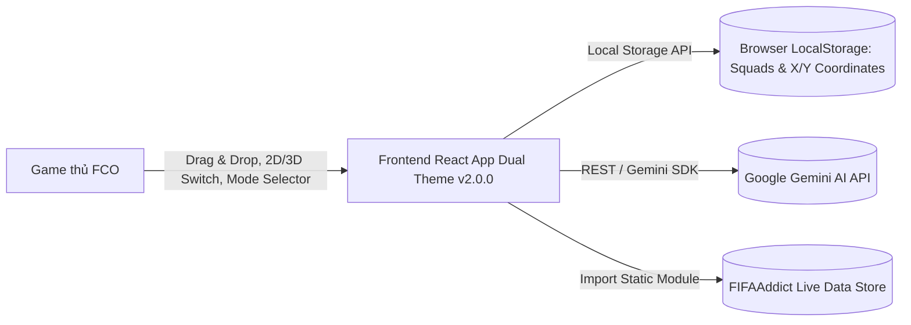
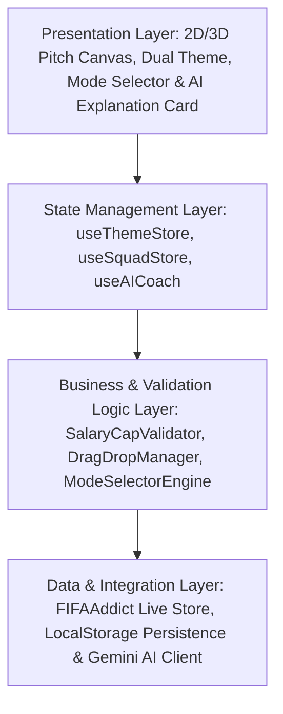
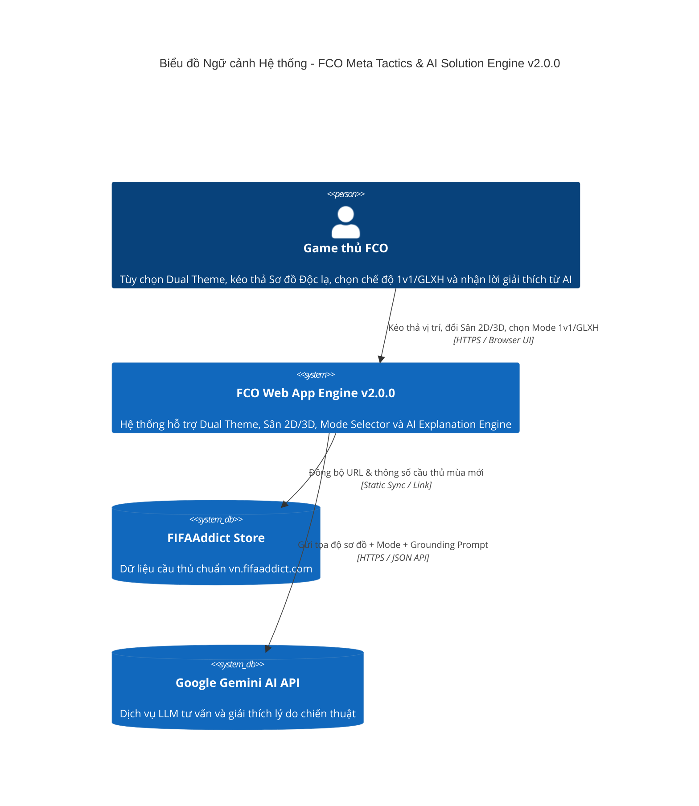
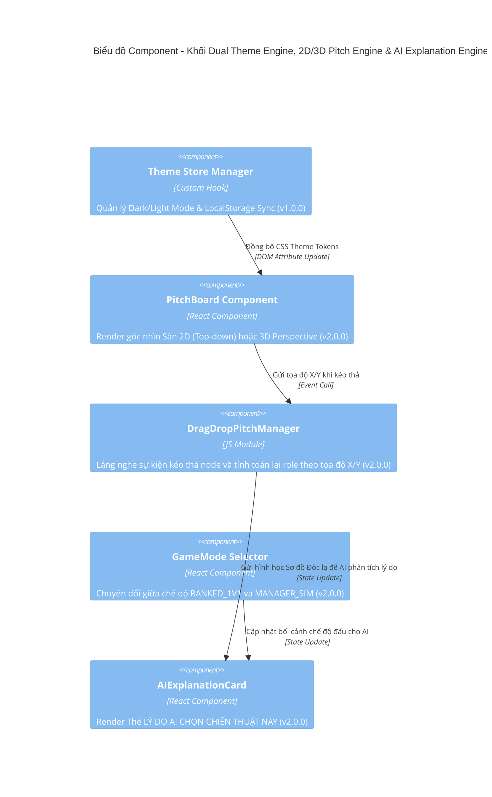

# TÀI LIỆU KIẾN TRÚC HỆ THỐNG (SAD) v2.0.0 - FCO META TACTICS & AI SOLUTION ENGINE

| Thông tin         | Chi tiết         |
| :---------------- | :--------------- |
| **Dự án**         | FCO Meta Tactics & AI Solution Engine |
| **Phiên bản**     | **2.0.0 (OFFICIAL RELEASE)** |
| **Ngày cập nhật** | 24/07/2026       |
| **Trạng thái**    | APPROVED / READY FOR FE-BE DEVELOPMENT |
| **Tác giả**       | Senior System Architect & Tech Lead |

---

## NHẬT KÝ THAY ĐỔI

| Version | Ngày | Người sửa | Mô tả thay đổi |
| :--- | :--- | :--- | :--- |
| 1.0.0 | 24/07/2026 | Senior Architect & FE Lead | Phiên bản SAD MVP v1.0.0 (APPROVED): Tích hợp Dual Theme (Dark/Light), Dynamic Salary Cap (300) & AI Coach Grounding. |
| 2.0.0 | 24/07/2026 | Senior Architect & Tech Lead | **Nâng cấp SAD v2.0.0 (APPROVED)**: Kế thừa 100% kiến trúc v1.0.0 (Backward Compatible), mở rộng Drag & Drop 2D/3D Pitch Canvas Switcher, FIFAAddict Data Sync (`vn.fifaaddict.com`), Game Mode Selector (`RANKED_1V1` vs `MANAGER_SIM`) & AI Tactical Rationale Explanation Engine. Chuẩn hóa Lương trần 300. |

---

## 1. TỔNG QUAN VÀ MỤC TIÊU KIẾN TRÚC (v2.0.0)

Tài liệu Kiến trúc Hệ thống (SAD v2.0.0) mô tả chi tiết thiết kế kiến trúc kỹ thuật cho phiên bản nâng cấp, bảo đảm **tương thích ngược 100% (100% Backward Compatibility)** với kiến trúc nền tảng của SAD v1.0.0.

### 1.1 Ma trận Truy vết Kiến trúc & Đánh giá Tương thích Ngược (BRD-to-SAD Traceability & Compatibility Matrix)

| Mã Yêu cầu BRD | Nội dung Nghiệp vụ v2.0.0 | Kế thừa Kiến trúc v1.0.0 | Thành phần Mở rộng trong SAD v2.0.0 | Đánh giá Tương thích Ngược |
| :--- | :--- | :--- | :--- | :---: |
| **BR-GAME-01** | Lương trần 300 (không dùng chữ BP) | `SalaryCapValidator` (`CURRENT_SALARY_CAP = 300`) | Giữ nguyên logic `Sum(Salary) <= 300`, loại bỏ hậu tố string BP | 🟢 Tương thích 100% |
| **BR-UI-06** | Dual Theme (Dark/Light Mode) | `useThemeStore` & Dynamic CSS Tokens | Giữ nguyên 100% CSS Tokens system (`[data-theme="dark/light"]`) | 🟢 Tương thích 100% |
| **BR-PITCH-11** | Drag & Drop Sơ đồ Độc lạ | `PitchBoardView.jsx` (Sân bóng 2D) | Mở rộng `DragDropPitchManager` nhận sự kiện kéo thả X/Y | 🟢 Tương thích 100% |
| **BR-MODE-12** | Chọn chế độ Đấu 1v1 vs Giả Lập GLXH | State management toàn cục | Thêm State `gameMode` (`'RANKED_1V1'` \| `'MANAGER_SIM'`) | 🟢 Tương thích 100% |
| **BR-AI-13** | AI Tactical Rationale Explanation | `AICoachConsoleView.jsx` & Gemini API | Thêm Component `AIExplanationCard.jsx` render khối giải thích | 🟢 Tương thích 100% |
| **BR-DATA-14** | Dữ liệu FIFAAddict (`vn.fifaaddict.com`) | `META_PLAYERS` JSON Store | Module `FIFAAddictLiveAdapter` bổ sung thuộc tính `fifaAddictUrl` | 🟢 Tương thích 100% |

---

## 2. RÀNG BUỘC KIẾN TRÚC

- **Frontend Framework:** React.js 18+ với Vite Build Tool (Single Page Application - SPA) giúp đóng gói production bundle tối ưu 60fps.
- **State Management:** React Context API + Custom Reactive Hooks (`useSquadStore`, `useAICoach`, `usePlayerDB`, `useThemeStore`).
- **Styling & Theme Engine:** Dynamic CSS Variables Tokens System (`[data-theme="dark"]` và `[data-theme="light"]`) kết hợp CSS Perspective Transformation (`transform: rotateX(42deg)`).
- **Lưu trữ Dữ liệu:** LocalStorage Persistence (Lưu trữ `theme_preference`, `squad_list` kèm custom X/Y coordinates) + Static JSON Modules (`data/players.json` đồng bộ FIFAAddict URL).
- **Hạ tầng (Infrastructure):** Vercel / Netlify Edge CDN + Google Gemini AI API (Model Gemini Flash).

---

## 3. BỐI CẢNH VÀ PHẠM VI

Mô tả bối cảnh giao tiếp giữa Game thủ FCO, Frontend Web App v2.0.0, FIFAAddict Data Store và Gemini AI API Engine:



---

## 4. KIẾN TRÚC DỮ LIỆU & LƯU TRỮ

- **FIFAAddict Live Data Adapter:** Bổ sung trường `fifaAddictUrl` và `season` vào schema `META_PLAYERS`.
- **Drag & Drop Coordinates Storage:** Mỗi slot cầu thủ trong `slotMap` lưu trữ bổ sung thuộc tính vị trí linh hoạt `{ gridX, gridY }`.
- **Game Mode State Storage:** Lưu trữ trạng thái `gameMode` (`'RANKED_1V1'` hoặc `'MANAGER_SIM'`) trong SessionState và Squad Persistence Object.

---

## 5. CẤU TRÚC KHỐI (BUILDING BLOCK VIEW v2.0.0)

### 5.1 Cấu trúc Phân tầng (Layered Architecture)



### 5.2 Phân rã Component Hierarchy (React Components Tree v2.0.0)

```
src/
├── components/
│   ├── common/
│   │   ├── Header.jsx                 # Navbar, Theme Switcher & Game Mode Selector (1v1 vs GLXH)
│   │   ├── SalaryCounterBar.jsx       # Thanh đo Lương trần (X / 300 - Chuẩn không dùng chữ BP)
│   ├── PitchBoard/
│   │   ├── PitchBoardView.jsx         # Sân bóng tương tác (Hỗ trợ 2D/3D Toggle & Perspective View)
│   │   ├── PlayerSlotNode.jsx         # Slot vị trí cầu thủ hỗ trợ event Drag & Drop X/Y
│   │   └── PitchViewToggleBtn.jsx     # Công tắc chuyển đổi góc nhìn 2D <-> 3D
│   ├── AICoach/
│   │   ├── AICoachConsoleView.jsx     # Console AI Coach tích hợp Game Mode Context
│   │   └── AIExplanationCard.jsx      # Thẻ Render LÝ DO AI CHỌN CHIẾN THUẬT NÀY (AI Rationale Engine)
│   ├── PlayerDB/
│   │   ├── PlayerDBView.jsx           # Tra cứu dữ liệu đồng bộ vn.fifaaddict.com
│   │   └── PlayerCompareModal.jsx     # Bảng so sánh đối đầu Side-by-side
```

---

## 6. CÁC KHÍA CẠNH PHI CHỨC NĂNG

### 6.1 Chiến lược Caching
- **RAM Cache:** Cache tọa độ kéo thả node trong React State trong suốt quá trình drag.
- **LocalStorage Persistence:** Lưu trạng thái `gameMode` và `pitchPerspective` (`2D` / `3D`).
- **AI Rationale Cache:** Cache câu trả lời giải thích lý do của AI Coach theo Hash của sơ đồ dị.

### 6.2 Logging & Monitoring
- Đo lường SLA: Drag & Drop `< 16ms`, Pitch Toggle `< 50ms`, AI Latency `< 3.0s`.

### 6.3 Quản lý Cấu hình (Configuration Management)
- Quản lý biến trần Lương toàn cục `CURRENT_SALARY_CAP = 300` dạng integer.

---

## 7. KHUNG NHÌN THỜI GIAN CHẠY (RUNTIME VIEW)

### Luồng xử lý Kéo thả Sơ đồ Độc lạ & Gọi AI Explanation Engine

1. **[Bước 1]:** Người dùng chọn Chế độ Đấu `MANAGER_SIM` trên Header.
2. **[Bước 2]:** Click nút `PitchViewToggleBtn` chuyển sang Sân bóng 3D Perspective (`rotateX(42deg)`).
3. **[Bước 3]:** Kéo & Thả các node vị trí `PlayerSlotNode` tạo Sơ đồ dị tùy biến (VD: 3-1-3-3).
4. **[Bước 4]:** `DragDropPitchManager` ghi nhận tọa độ `gridX/gridY` và tự động cập nhật State.
5. **[Bước 5]:** Bấm "Nhờ AI Coach Phân Tích & Giải Thích" -> Component `AIExplanationCard` render khối LÝ DO AI ĐỀ XUẤT CHIẾN THUẬT NÀY.

---

## 8. KHUNG NHÌN TRIỂN KHAI (DEPLOYMENT VIEW)

- **Đóng gói (Packaging):** Vite Production Build (`npm run build`).
- **Hosting / Edge CDN:** Vercel / Netlify Edge Deployment.
- **Run Scripts:** `npm run dev` (Port 5173 / 5174), `npm run build`.

---

## BIỂU ĐỒ MÔ HÌNH C4 (C4 MODEL DIAGRAMS v2.0.0)

### Cấp độ 1: System Context Diagram (Biểu đồ Ngữ cảnh Hệ thống v2.0.0)



---

### Cấp độ 2: Container Diagram (Biểu đồ Container v2.0.0)

```mermaid
C4Container
    title Biểu đồ Container - FCO Meta Tactics & AI Solution Engine v2.0.0

    Container(spa, "Single Page Web App", "React.js, Dynamic CSS Tokens", "Render Dual Theme, Sân 2D/3D Perspective Canvas, Mode Selector & AI Explanation Card")
    ContainerDb(localData, "FIFAAddict Data Store", "JSON Store", "Lưu trữ dữ liệu cầu thủ chuẩn vn.fifaaddict.com")
    ContainerDb(storage, "Browser LocalStorage", "HTML5 Web Storage", "Lưu trữ Theme Preference, Squads cá nhân kèm custom X/Y coordinates")
    Container(aiEngine, "AI Coach Explanation Service", "JS Service", "Đóng gói bối cảnh Sơ đồ Độc lạ + Mode và phân tích Tactical Rationale")

    Rel(spa, localData, "Đọc danh mục cầu thủ FIFAAddict", "JS Import")
    Rel(spa, storage, "Lưu & đọc Theme Preference & Squads", "Web Storage API")
    Rel(spa, aiEngine, "Yêu cầu AI tư vấn & giải thích lý do", "Function Call")
    Rel(aiEngine, gemini, "Gọi Gemini Flash sinh JSON Rationale", "REST / HTTPS")
```

---

### Cấp độ 3: Component Diagram (Biểu đồ Component - Dual Theme Engine, 2D/3D Pitch Engine & AI Explanation Engine)



---

END OF SAD DOCUMENT v2.0.0
