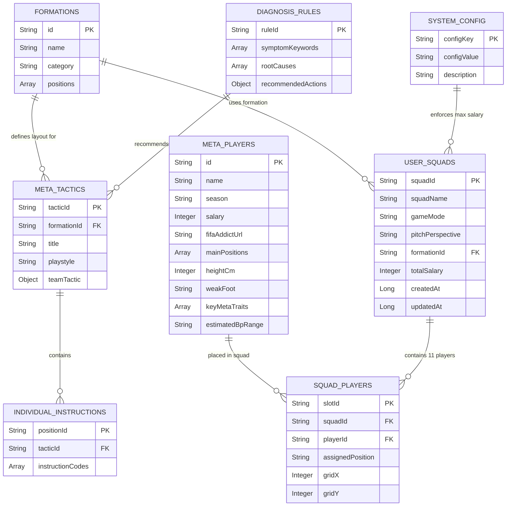

# TÀI LIỆU THIẾT KẾ CƠ SỞ DỮ LIỆU (DBD) v2.0.0 - FCO META TACTICS & AI SOLUTION ENGINE

| Thông tin         | Chi tiết                 |
| :---------------- | :----------------------- |
| **Dự án**         | FCO Meta Tactics & AI Solution Engine |
| **Phiên bản**     | **2.0.0 (OFFICIAL RELEASE)** |
| **Ngày cập nhật** | 24/07/2026               |
| **Trạng thái**    | APPROVED / READY FOR FE-BE DEVELOPMENT |
| **Tác giả**       | Senior Data Architect & BA |
| **Cơ sở dữ liệu** | Client-Side Static JSON Store (FIFAAddict Live Sync) & HTML5 LocalStorage Persistence |

---

## NHẬT KÝ THAY ĐỔI

| Version | Ngày | Người sửa | Mô tả thay đổi |
| :--- | :--- | :--- | :--- |
| 1.0.0 | 24/07/2026 | Senior Data Architect | Phiên bản DBD MVP v1.0.0 (APPROVED): Định nghĩa các thực thể cốt lõi cho Sơ đồ 2D, Lương trần 300, Đội hình cá nhân & AI Rules. |
| 2.0.0 | 24/07/2026 | Senior Data Architect | **Nâng cấp DBD v2.0.0 (APPROVED)**: Đồng bộ Schema cầu thủ FIFAAddict (`vn.fifaaddict.com`), bổ sung thuộc tính `fifaAddictUrl`, `season` mới nhất (`ICON TM`, `24TS`, `EU24`, `CU`, `24UCL`), bổ sung thuộc tính tọa độ kéo thả `gridX/gridY` cho Sơ đồ Độc lạ và thuộc tính `gameMode` (`RANKED_1V1` \| `MANAGER_SIM`). Chuẩn hóa Lương trần 300. |

---

## 1. SƠ ĐỒ THỰC THỂ KẾT HỢP (ERD v2.0.0)

Sơ đồ ERD (Entity Relationship Diagram v2.0.0) đặc tả toàn bộ thực thể dữ liệu và mối quan hệ trong hệ thống:

---

## 2. CHI TIẾT BẢNG DỮ LIỆU (TABLE DEFINITIONS v2.0.0)

### 2.1. `META_PLAYERS` (Danh mục Cầu thủ Đồng bộ FIFAAddict - `vn.fifaaddict.com`)
Bảng lưu trữ danh mục cầu thủ tiêu biểu và các mùa giải mới nhất, được cập nhật thông số chuẩn từ `vn.fifaaddict.com` (`data/players.json`).

| Tên trường (Field Name) | Kiểu dữ liệu | Bắt buộc (Null?) | Mô tả & Ràng buộc (Description & Constraints) |
| :--- | :--- | :---: | :--- |
| `id` | String | **No** (PK) | Mã cầu thủ duy nhất (VD: `"p_shevchenko_icontm"`). |
| `name` | String | **No** | Tên cầu thủ hiển thị (VD: `"A. Shevchenko"`). |
| `season` | String | **No** | Thẻ mùa giải mới nhất (VD: `"ICON TM"`, `"24TS"`, `"EU24"`, `"CU"`, `"24UCL"`). |
| `salary` | Integer | **No** | Mức Lương trong game (Integer, VD: `28`). |
| `fifaAddictUrl` | String | **No** | URL liên kết bài viết chi tiết tại `vn.fifaaddict.com`. |
| `mainPositions` | Array | **No** | Danh sách các vị trí thi đấu chính (VD: `["ST", "CF"]`). |
| `heightCm` | Integer | **Yes** | Chiều cao tính bằng cm (VD: `183`). |
| `weakFoot` | String | **Yes** | Chỉ số chân nghịch (VD: `"5/5"`). |
| `keyMetaTraits` | Array | **No** | Các chỉ số ẩn và đặc tính meta chính (VD: `["Sút xa ZD bá đạo", "Tốc độ xé nách"]`). |
| `estimatedBpRange` | String | **Yes** | Giá tham khảo trong game (VD: `"35B - 50B BP"`). |

---

### 2.2. `USER_SQUADS` (Đội hình Cá nhân v2.0.0 - LocalStorage Persistence)
Bảng lưu trữ danh sách đội hình người dùng trong Browser LocalStorage (`key: "fco_user_squads"`).

| Tên trường (Field Name) | Kiểu dữ liệu | Bắt buộc (Null?) | Mô tả & Ràng buộc (Description & Constraints) |
| :--- | :--- | :---: | :--- |
| `squadId` | String | **No** (PK) | Định danh duy nhất đội hình (VD: `"sq_987654"`). |
| `squadName` | String | **No** | Tên đội hình do người dùng đặt (Tối đa 50 ký tự). |
| `gameMode` | String | **No** | Chế độ đấu (`"RANKED_1V1"` \| `"MANAGER_SIM"`). Mặc định: `"RANKED_1V1"`. |
| `pitchPerspective` | String | **No** | Góc nhìn sân (`"2D"` \| `"3D"`). Mặc định: `"2D"`. |
| `formationId` | String | **No** (FK) | Mã sơ đồ gốc hoặc sơ đồ tùy biến (VD: `"4-2-3-1"`, `"custom_drak_3133"`). |
| `totalSalary` | Integer | **No** | Tổng Lương của 11 cầu thủ (`Sum(salary) <= 300`). |
| `createdAt` | Long | **No** | Timestamp thời điểm tạo đội hình. |
| `updatedAt` | Long | **No** | Timestamp thời điểm cập nhật lần cuối. |

---

### 2.3. `SQUAD_PLAYERS` (Chi tiết 11 Vị trí Cầu thủ & Tọa độ Kéo thả X/Y)
Bảng lưu chi tiết 11 vị trí cầu thủ trong đội hình, hỗ trợ tọa độ kéo thả Sơ đồ Độc lạ.

| Tên trường (Field Name) | Kiểu dữ liệu | Bắt buộc (Null?) | Mô tả & Ràng buộc (Description & Constraints) |
| :--- | :--- | :---: | :--- |
| `slotId` | String | **No** (PK) | Mã slot vị trí trên sân (VD: `"slot_st"`, `"slot_cam"`). |
| `squadId` | String | **No** (FK) | Mã đội hình sở hữu. |
| `playerId` | String | **No** (FK) | Mã cầu thủ được gán vào slot. |
| `assignedPosition` | String | **No** | Vị trí thi đấu (VD: `"ST"`, `"LW"`, `"CDM"`). |
| `gridX` | Integer | **Yes** | Tọa độ X kéo thả tính theo phần trăm màn hình sân (0 -> 100%). |
| `gridY` | Integer | **Yes** | Tọa độ Y kéo thả tính theo phần trăm màn hình sân (0 -> 100%). |

---

### 2.4. `FORMATIONS` (Sơ đồ Mặc định & Phân loại)
Bảng định nghĩa các sơ đồ bóng đá mặc định (`data/formations.json`).

| Tên trường (Field Name) | Kiểu dữ liệu | Bắt buộc (Null?) | Mô tả & Ràng buộc |
| :--- | :--- | :---: | :--- |
| `id` | String | **No** (PK) | Mã sơ đồ (VD: `"4-2-3-1"`, `"4-1-2-3"`). |
| `name` | String | **No** | Tên sơ đồ hiển thị. |
| `category` | String | **No** | Phân loại sơ đồ (`"Balanced"`, `"Attacking"`, `"Defensive"`). |
| `positions` | Array | **No** | Danh sách 11 vị trí kèm tọa độ gốc. |

---

### 2.5. `SYSTEM_CONFIG` (Cấu hình Lương trần Động System)
Bảng quản lý các cấu hình toàn cục (`key: "fco_system_config"`).

| Tên trường (Field Name) | Kiểu dữ liệu | Bắt buộc (Null?) | Mô tả & Ràng buộc |
| :--- | :--- | :---: | :--- |
| `configKey` | String | **No** (PK) | Khóa cấu hình (`"CURRENT_SALARY_CAP"`). |
| `configValue` | String | **No** | Giá trị cấu hình (Giá trị hiện tại: `"300"`). |
| `description` | String | **Yes** | Mô tả biến cấu hình. |

---

## 3. CHỈ MỤC VÀ HIỆU NĂNG (INDEXING & PERFORMANCE v2.0.0)

- **In-Memory Map Indexing:** Index theo `playerId` và `fifaAddictUrl` trên Client-side RAM đảm bảo tốc độ phản hồi kéo thả và hiển thị chi tiết `< 16ms` (60fps).
- **Fallback Tương thích Ngược Schema:** Nếu dữ liệu `USER_SQUADS` cũ từ v1.0.0 không có thuộc tính `gridX/gridY` hoặc `gameMode`, hệ thống tự động gán giá trị mặc định (`gridX/gridY` theo `FORMATIONS` gốc, `gameMode = 'RANKED_1V1'`).

---

END OF DBD DOCUMENT v2.0.0
