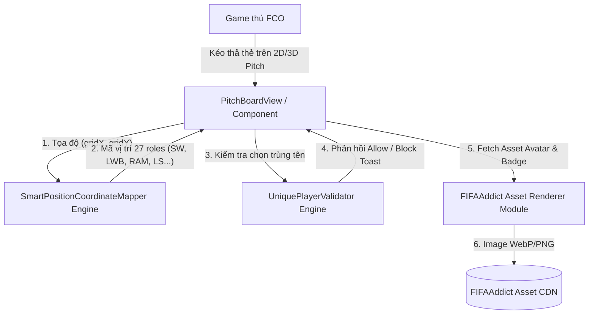

# TÀI LIỆU KIẾN TRÚC HỆ THỐNG (SAD) v3.0.0 - FCO META TACTICS & AI SOLUTION ENGINE

| Thông tin         | Chi tiết         |
| :---------------- | :--------------- |
| **Dự án**         | FCO Meta Tactics & AI Solution Engine |
| **Phiên bản**     | **3.0.0 (PROPOSED DRAFT)** |
| **Ngày cập nhật** | 25/07/2026       |
| **Trạng thái**    | DRAFT / PENDING USER APPROVAL |
| **Tác giả**       | Senior System Architect & Tech Lead |

---

## NHẬT KÝ THAY ĐỔI

| Version | Ngày | Người sửa | Mô tả thay đổi |
| :--- | :--- | :--- | :--- |
| 1.0.0 | 24/07/2026 | Senior Architect & FE Lead | Phiên bản SAD MVP v1.0.0 (APPROVED): Tích hợp Dual Theme (Dark/Light), Dynamic Salary Cap (300) & AI Coach Grounding. |
| 2.0.0 | 24/07/2026 | Senior Architect & Tech Lead | Nâng cấp SAD v2.0.0 (APPROVED): Kéo thả 2D/3D Pitch Canvas Switcher, FIFAAddict Data Sync (2,306 thẻ), Game Mode Selector (`RANKED_1V1` vs `MANAGER_SIM`) & AI Tactical Rationale Engine. Chuẩn hóa Lương số. |
| 3.0.0 | 25/07/2026 | Senior Architect & Tech Lead | **Đề xuất SAD v3.0.0 (DRAFT FOR REVIEW)**: Thiết kế Module `UniquePlayerValidator` (Ràng buộc 1 tên cầu thủ duy nhất trên 11 slots), Thuật toán `SmartPositionCoordinateMapper` nâng cao (Phân vùng 27 vị trí FO4 chuyên sâu: `SW`, `LWB`, `RWB`, `LAM`, `RAM`, `LF`, `RF`, `LS`, `RS`...), và Module `FIFAAddictAssetRenderer` (Render chân dung & logo mùa giải chuẩn game). |

---

## 1. TỔNG QUAN VÀ MỤC TIÊU KIẾN TRÚC (v3.0.0)

Tài liệu Kiến trúc Hệ thống (SAD v3.0.0) mô tả chi tiết thiết kế kỹ thuật cho 3 phân hệ mở rộng của Version 3.0.0, bảo đảm **tương thích ngược 100% (100% Backward Compatibility)** với nền tảng v1.0.0 và v2.0.0.

### 1.1 Ma trận Truy vết Kiến trúc & Đánh giá Tương thích Ngược (BRD-to-SAD Traceability Matrix)

| Mã Yêu cầu BRD | Nội dung Nghiệp vụ v3.0.0 | Component Kế thừa v2.0.0 | Thành phần Kiến trúc Mở rộng v3.0.0 | Đánh giá Tương thích Ngược |
| :--- | :--- | :--- | :--- | :---: |
| **FR-3.1** | Ràng buộc Duy nhất 1 Tên Cầu thủ trên Sơ đồ | `useSquadStore.js` | Module `UniquePlayerValidator` (Check normalized name conflict trên 11 slots) | 🟢 Tương thích 100% |
| **FR-3.2** | Tự động Thích ứng Vị trí Động (27 Vị trí) | `PitchBoardView.jsx` | Engine `SmartPositionCoordinateMapper` (`calculatePositionFromCoords`) | 🟢 Tương thích 100% |
| **FR-3.3** | Visual Thẻ Cầu Thủ Chuẩn Game FIFAAddict | `PlayerDBView.jsx` & `PitchBoardView.jsx` | Module `FIFAAddictAssetRenderer` (`avatarUrl`, `seasonBadgeUrl` with fallback) | 🟢 Tương thích 100% |

---

## 2. RÀNG BUỘC KIẾN TRÚC

- **Frontend Framework:** React.js 18+ với Vite Build Tool (Single Page Application - SPA) bảo đảm hiệu năng render `< 16ms` (60fps).
- **State Management:** Custom Reactive Hooks (`useSquadStore`, `useAICoach`, `usePlayerDB`, `useThemeStore`).
- **Coordinate System:** Hệ tọa độ phần trăm tương đối `(gridX %, gridY %)` từ `0.0%` đến `100.0%` được chuẩn hóa trên cả Canvas 2D và 3D Perspective.
- **Data Stores & Asset Resolvers:** Static JSON Stores (`data/players.json` 2,306 cards) + FIFAAddict Asset CDN Resolvers.

---

## 3. BỐI CẢNH VÀ PHẠM VI KIẾN TRÚC (MERMAID DIAGRAM)



---

## 4. THIẾT KẾ CÁC SUB-SYSTEMS & THUẬT TOÁN KỸ THUẬT CHI TIẾT (v3.0.0)

### 4.1 Module Kiểm Soát Duy Nhất Tên Cầu Thủ (UniquePlayerValidator)

Module nằm trong `useSquadStore.js` thực hiện validate tên cầu thủ chuẩn hóa trước khi gán vào bất kỳ slot nào trong 11 vị trí chính thức:

```javascript
/**
 * Validate unique player name constraint across active 11 squad slots
 * @param {Object} candidatePlayer - Thẻ cầu thủ muốn chọn/gán
 * @param {String} targetSlotId - Slot ID hiện tại đang chọn
 * @param {Object} currentPositions - Map các slot vị trí hiện tại trên sân
 * @returns {Object} { allowed: boolean, conflictSeason?: string, conflictName?: string }
 */
export function validateUniquePlayerConstraint(candidatePlayer, targetSlotId, currentPositions) {
  if (!candidatePlayer || !candidatePlayer.name) return { allowed: true };

  const normCandidateName = candidatePlayer.name.toLowerCase().trim();

  for (const [slotId, slotData] of Object.entries(currentPositions)) {
    // Bỏ qua chính slot đang được thay thế
    if (slotId === targetSlotId) continue;

    if (slotData.player && slotData.player.name) {
      const normExistingName = slotData.player.name.toLowerCase().trim();
      if (normExistingName === normCandidateName) {
        return {
          allowed: false,
          conflictName: slotData.player.name,
          conflictSeason: slotData.player.season,
          conflictSlotId: slotId
        };
      }
    }
  }

  return { allowed: true };
}
```

---

### 4.2 Engine Phân Vùng Tọa Độ Vị Trí Động 27 Vị Trí (SmartPositionCoordinateMapper)

Thuật toán `calculatePositionFromCoords(gridX, gridY)` chuyển đổi tọa độ phần trăm `(gridX %, gridY %)` thành 1 trong 27 mã vị trí chuẩn của FO4/FCO:

```javascript
/**
 * Smart Pitch Position Coordinate Mapper (Full-Spectrum 27 Positions)
 * @param {Number} gridX - Tọa độ ngang (0% trái -> 100% phải)
 * @param {Number} gridY - Tọa độ dọc (0% sân đối phương -> 100% sân nhà)
 * @returns {String} Mã vị trí FO4 (GK, SW, CB, LWB, CDM, CAM, LAM, ST, LS...)
 */
export function calculatePositionFromCoords(gridX, gridY) {
  // 1. Vùng Thủ Môn
  if (gridY >= 88) return 'GK';

  // 2. Vùng Thòng (Sweeper - SW) sát khung thành đằng sau CB
  if (gridY >= 80 && gridY < 88 && gridX >= 40 && gridX <= 60) {
    return 'SW';
  }

  // 3. Vùng Hậu Vệ & Cánh dâng cao (68% <= gridY < 88%)
  if (gridY >= 68) {
    if (gridX <= 18) return 'LWB';
    if (gridX <= 30) return 'LB';
    if (gridX <= 42) return 'LCB';
    if (gridX <= 58) return 'CB';
    if (gridX <= 70) return 'RCB';
    if (gridX <= 82) return 'RB';
    return 'RWB';
  }

  // 4. Vùng Tiền Vệ Phòng Ngự (52% <= gridY < 68%)
  if (gridY >= 52) {
    if (gridX <= 35) return 'LDM';
    if (gridX <= 65) return 'CDM';
    return 'RDM';
  }

  // 5. Vùng Tiền Vệ Trung Tâm (35% <= gridY < 52%)
  if (gridY >= 35) {
    if (gridX <= 35) return 'LCM';
    if (gridX <= 65) return 'CM';
    return 'RCM';
  }

  // 6. Vùng Tiền Vệ Tấn Công & Cánh (20% <= gridY < 35%)
  if (gridY >= 20) {
    if (gridX <= 18) return 'LM';
    if (gridX <= 38) return 'LAM';
    if (gridX <= 62) return 'CAM';
    if (gridX <= 82) return 'RAM';
    return 'RM';
  }

  // 7. Vùng Tiền Đạo (gridY < 20%)
  if (gridX <= 22) return 'LW';
  if (gridX <= 36) return 'LF';
  if (gridX <= 48) return 'LS';
  if (gridX <= 52) return 'ST';
  if (gridX <= 64) return 'RS';
  if (gridX <= 78) return 'RF';
  return 'RW';
}
```

---

### 4.3 Module Render Asset Thẻ Cầu Thủ FIFAAddict (FIFAAddictAssetRenderer)

Xây dựng bộ giải quyết đường dẫn ảnh asset chân dung và logo mùa giải từ FIFAAddict CDN với cơ chế Fallback an toàn:

```javascript
export function getPlayerAvatarUrl(player) {
  if (player.avatarUrl) return player.avatarUrl;
  const uid = player.fifaAddictUrl ? player.fifaAddictUrl.split('/').pop() : player.id.replace('p_', '');
  return `https://vn.fifaaddict.com/fo4db/assets/players/p${uid}.png`;
}

export function getSeasonBadgeUrl(seasonCode) {
  if (!seasonCode) return null;
  return `https://vn.fifaaddict.com/fo4db/assets/season/${seasonCode.toLowerCase()}.png`;
}
```

---

## 5. ĐÁNH GIÁ HIỆU NĂNG VÀ TƯƠNG THÍCH NGƯỢC (PERFORMANCE & COMPATIBILITY)

- **Hiệu năng Render UI:** Thuật toán `calculatePositionFromCoords` thực hiện bằng các phép so sánh số nguyên nhẹ `< 0.1ms`, không gây giật lag khi kéo thả 60fps.
- **Tương thích ngược 100%:** 
  - Không thay đổi cấu trúc dữ liệu lưu trữ LocalStorage cũ.
  - Các sơ đồ mặc định v1.0.0 và v2.0.0 được tự động chuyển đổi tọa độ phần trăm sang mã vị trí mới một cách mượt mà.
  - Toàn bộ 2,306 thẻ cầu thủ hiện tại hiển thị đầy đủ avatar và logo mùa giải mới.
