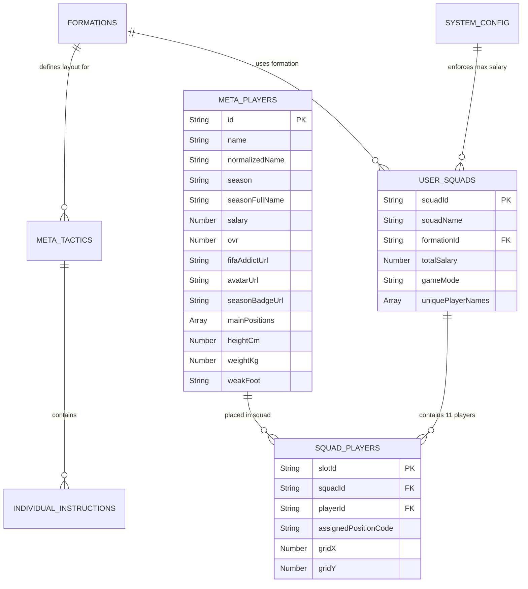

# TÀI LIỆU THIẾT KẾ CƠ SỞ DỮ LIỆU (DBD) v3.0.0 - FCO META TACTICS & AI SOLUTION ENGINE

| Thông tin         | Chi tiết                 |
| :---------------- | :----------------------- |
| **Dự án**         | FCO Meta Tactics & AI Solution Engine |
| **Phiên bản**     | **3.0.0 (PROPOSED DRAFT)** |
| **Ngày cập nhật** | 25/07/2026               |
| **Trạng thái**    | DRAFT / PENDING USER APPROVAL |
| **Tác giả**       | Senior Data Architect & BA |
| **Cơ sở dữ liệu** | Client-Side Static JSON Store (FIFAAddict Asset Sync) & HTML5 LocalStorage Persistence |

---

## NHẬT KÝ THAY ĐỔI

| Version | Ngày | Người sửa | Mô tả thay đổi |
| :--- | :--- | :--- | :--- |
| 1.0.0 | 24/07/2026 | Senior Data Architect | Phiên bản DBD MVP v1.0.0 (APPROVED): Định nghĩa các thực thể cốt lõi cho Sơ đồ 2D, Lương trần 300, Đội hình cá nhân & AI Rules. |
| 2.0.0 | 24/07/2026 | Senior Data Architect | Nâng cấp DBD v2.0.0 (APPROVED): Đồng bộ 2,306 thẻ cầu thủ chuẩn FIFAAddict, thuộc tính `fifaAddictUrl`, thuộc tính tọa độ kéo thả `gridX/gridY` và `gameMode`. Chuẩn hóa Lương số. |
| 3.0.0 | 25/07/2026 | Senior Data Architect | **Đề xuất DBD v3.0.0 (DRAFT FOR REVIEW)**: Bổ sung thuộc tính `avatarUrl` (chân dung cầu thủ) & `seasonBadgeUrl` (logo mùa giải), mở rộng miền giá trị 27 mã vị trí thi đấu `assignedPositionCode` (`SW`, `LWB`, `RWB`, `LAM`, `RAM`, `LF`, `RF`, `LS`, `RS`...) và định nghĩa thuộc tính khóa trùng tên `normalizedPlayerName`. |

---

## 1. SƠ ĐỒ THỰC THỂ KẾT HỢP (ERD v3.0.0)

---

## 2. ĐỊNH NGHĨA SCHEMA CƠ SỞ DỮ LIỆU CHI TIẾT (v3.0.0 EXTENSION)

### 2.1 Thực Thể META_PLAYERS (Store 2,306 Thẻ Cầu Thủ)

| Tên thuộc tính | Kiểu dữ liệu | Ràng buộc | Mô tả |
| :--- | :--- | :--- | :--- |
| `id` | String | PK, Not Null | ID thẻ cầu thủ (Ví dụ: `"p_aavmwaaqy"`) |
| `name` | String | Not Null | Tên hiển thị cầu thủ (Ví dụ: `"Cristiano Ronaldo"`) |
| `normalizedName` | String | Not Null, Index | Tên chuẩn hóa chữ thường để validate trùng tên (`"cristiano ronaldo"`) |
| `season` | String | Not Null | Mã ngắn mùa giải (`"26TY"`, `"IPRM"`, `"ICONTM"`) |
| `salary` | Number | Not Null | Điểm Lương trần (Số nguyên, không dùng chữ BP) |
| `ovr` | Number | Not Null | Chỉ số tổng quát OVR (Ví dụ: `133`) |
| `avatarUrl` | String | Nullable | URL CDN ảnh chân dung thật từ FIFAAddict (`"https://vn.fifaaddict.com/fo4db/assets/players/p...png"`) |
| `seasonBadgeUrl` | String | Nullable | URL CDN Logo mùa giải từ FIFAAddict (`"https://vn.fifaaddict.com/fo4db/assets/season/...png"`) |

---

### 2.2 Thực Thể SQUAD_PLAYERS (11 Slots Vị Trí Đội Hình)

| Tên thuộc tính | Kiểu dữ liệu | Ràng buộc | Mô tả |
| :--- | :--- | :--- | :--- |
| `slotId` | String | PK, Not Null | ID slot vị trí (Ví dụ: `"slot_1"`) |
| `playerId` | String | FK, Nullable | FK tham chiếu tới `META_PLAYERS.id` |
| `assignedPositionCode` | String | Not Null | **27 Mã vị trí mở rộng:** `GK`, `SW`, `CB`, `LCB`, `RCB`, `LB`, `RB`, `LWB`, `RWB`, `CDM`, `LDM`, `RDM`, `CM`, `LCM`, `RCM`, `CAM`, `LAM`, `RAM`, `LM`, `RM`, `ST`, `LS`, `RS`, `CF`, `LF`, `RF`, `LW`, `RW`. |
| `gridX` | Number | Not Null | Tọa độ ngang phần trăm trên mặt sân (`0.0` đến `100.0`) |
| `gridY` | Number | Not Null | Tọa độ dọc phần trăm trên mặt sân (`0.0` đến `100.0`) |

---

## 3. QUY TẮC BẢO TOÀN DỮ LIỆU & ASSETS (DATA INTEGRITY & ASSET FALLBACK)

1. **Ràng buộc Duy nhất 1 Tên Cầu Thủ trong Squad (`uniquePlayerNames` Index):**
   - Mảng `USER_SQUADS.uniquePlayerNames` lưu danh sách các `normalizedName` của 11 cầu thủ chính thức.
   - Khi chọn/gán cầu thủ mới, nếu `candidatePlayer.normalizedName` trùng với giá trị đã có trong mảng `uniquePlayerNames`, thao tác gán bị từ chối.
2. **Cơ chế Fallback Asset Hình ảnh:**
   - Nếu `avatarUrl` lỗi mạng 404: Tự động render avatar mặc định silhouette bóng người.
   - Nếu `seasonBadgeUrl` lỗi 404: Tự động render badge dạng văn bản màu vàng kim `[SEASON]`.
