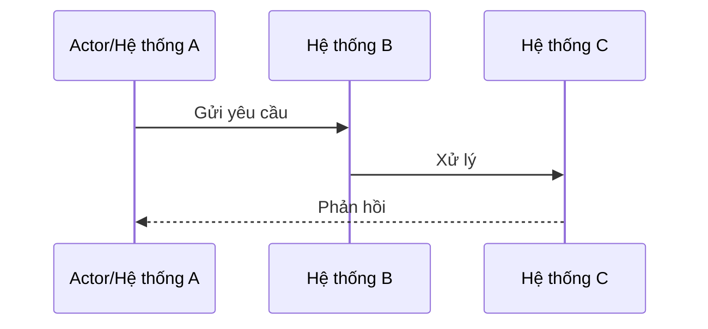

# TÀI LIỆU YÊU CẦU NGHIỆP VỤ (BRD) - {{PROJECT_NAME}}

| Thông tin        | Chi tiết                 |
| :--------------- | :----------------------- |
| **Dự án**        | {{PROJECT_NAME}}         |
| **Phiên bản**    | {{VERSION}}              |
| **Ngày cập nhật**| {{DATE}}                 |
| **Trạng thái**   | {{STATUS}}               |
| **Tác giả**      | {{AUTHOR}}               |

---

## LỊCH SỬ THAY ĐỔI
| Version | Ngày | Người sửa | Mô tả thay đổi |
| :--- | :--- | :--- | :--- |
| 1.0.0 | {{DATE}} | {{AUTHOR}} | Phiên bản đầu tiên |
| ... | ... | ... | ... |

---

## 1. TỔNG QUAN DỰ ÁN
Cung cấp mô tả tổng quan về hệ thống.

- **Mục đích:** <Hệ thống này giải quyết vấn đề gì>
- **Giá trị nghiệp vụ:** <Tại sao hệ thống này lại quan trọng>
- **Đối tượng người dùng:** <Ai sẽ sử dụng hệ thống này>

---

## 2. VẤN ĐỀ & CƠ HỘI

### Các vấn đề (Problems)
- <Vấn đề 1>
- <Vấn đề 2>

### Các cơ hội (Opportunities)
- <Cơ hội 1>
- <Cơ hội 2>

---

## 3. MỤC TIÊU DỰ ÁN

Xác định các mục tiêu có thể đo lường được:

- **Độ chính xác:** <VD: Các yêu cầu về tính nhất quán dữ liệu>
- **Hiệu năng:** <VD: thời gian phản hồi, thông lượng>
- **Tự động hóa:** <Quy trình thủ công → tự động>
- **Khả năng mở rộng:** <Lưu trữ, số lượng người dùng, lưu lượng truy cập>

---

## 4. PHẠM VI DỰ ÁN

### 4.1 Trong phạm vi (In Scope)
Liệt kê tất cả các tính năng được bao gồm:

- <Nhóm tính năng 1>
- <Nhóm tính năng 2>
- <Nhóm tính năng 3>

---

### 4.2 Ngoài phạm vi (Out of Scope)
Xác định rõ ràng các yếu tố bị loại trừ:

- <Mục ngoài phạm vi 1>
- <Mục ngoài phạm vi 2>

---

## 5. LUỒNG QUY TRÌNH NGHIỆP VỤ

Mô tả luồng công việc chính.

Ví dụ (Mermaid):

---

## 6. QUY TẮC NGHIỆP VỤ (BUSINESS RULES)

Định nghĩa logic nghiệp vụ, các ràng buộc và quy tắc tính toán cụ thể:

- **<Nhóm Quy tắc 1>:** <Logic chi tiết>
- **<Nhóm Quy tắc 2>:** <Logic chi tiết>
- **<Nhóm Quy tắc 3>:** <Logic chi tiết>

---

## 7. YÊU CẦU CHỨC NĂNG (FUNCTIONAL REQUIREMENTS)

| ID | Nhóm Tính Năng | Mô tả |
| :--- | :--- | :--- |
| F1 | <Tên Tính Năng> | <Mô tả> |
| F2 | <Tên Tính Năng> | <Mô tả> |

---

## 8. YÊU CẦU PHI CHỨC NĂNG (NON-FUNCTIONAL REQUIREMENTS)

- **Hiệu năng:** <Giới hạn thời gian phản hồi, VD: < 50ms>
- **Độ sẵn sàng:** <Yêu cầu về thời gian hoạt động, VD: 99.99%>
- **Khả năng mở rộng & Sức chứa:** <Khả năng chịu tải RPS cao điểm, giới hạn tài nguyên>
- **Bảo mật & Xác thực:** <Các hạn chế mạng, xác thực bằng token>
- **Lưu trữ:** <Giới hạn dung lượng dữ liệu>

---

## 9. CHỈ SỐ THÀNH CÔNG (SUCCESS METRICS)

- <CHỈ SỐ 1>
- <CHỈ SỐ 2>
- <CHỈ SỐ 3>

---

## 10. GHI CHÚ

- Tài liệu này chỉ định nghĩa các yêu cầu ở mức độ nghiệp vụ.
- Việc triển khai kỹ thuật chi tiết nên được định nghĩa trong:
    - Tài liệu Kiến trúc Hệ thống (SAD)
    - Tài liệu Thiết kế Cơ sở Dữ liệu (DBD)
    - Đặc tả Chức năng / Tài liệu điều hướng theo spec (Spec-driven docs)
    - Đặc tả API (OpenAPI)

---

END OF TEMPLATE
