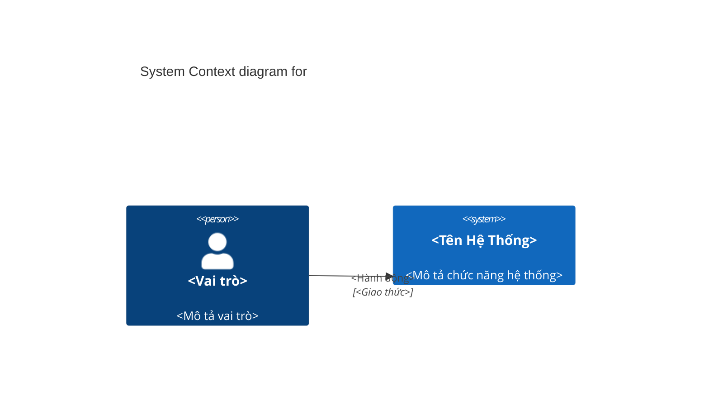
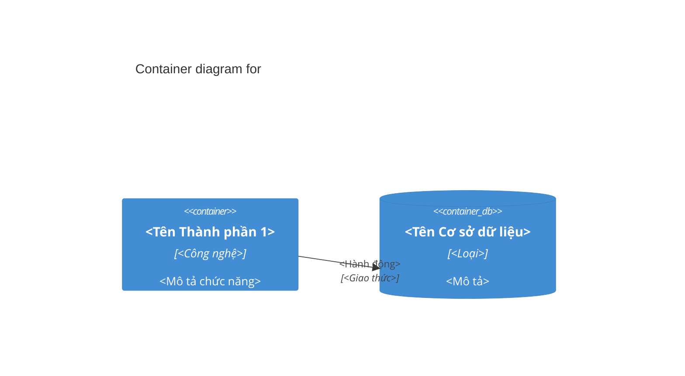
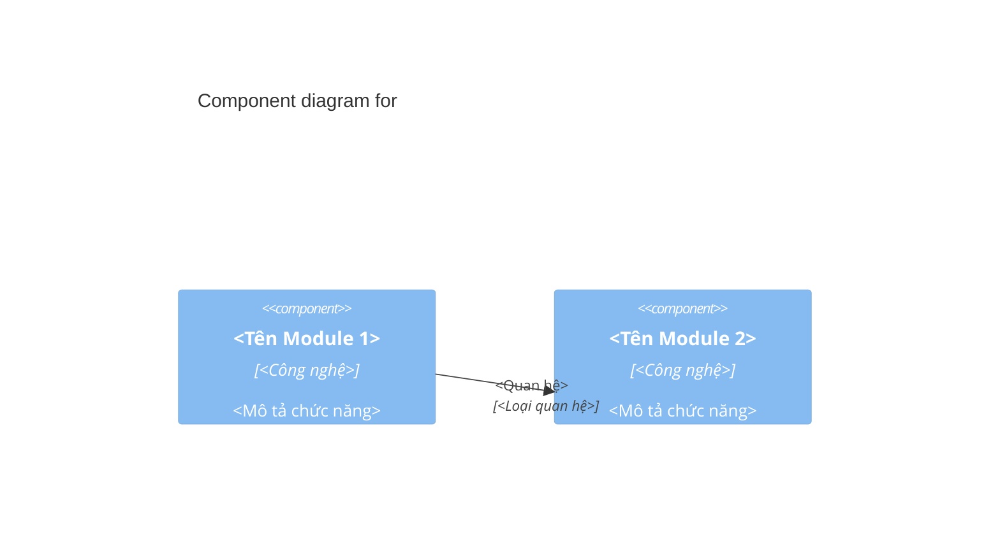

# TÀI LIỆU KIẾN TRÚC HỆ THỐNG (SAD) - {{PROJECT_NAME}}

| Thông tin         | Chi tiết         |
| :---------------- | :--------------- |
| **Dự án**         | {{PROJECT_NAME}} |
| **Phiên bản**     | {{VERSION}}      |
| **Ngày cập nhật** | {{DATE}}         |
| **Trạng thái**    | {{STATUS}}       |
| **Tác giả**       | {{AUTHOR}}       |

---

## NHẬT KÝ THAY ĐỔI

| Version     | Ngày     | Người sửa  | Mô tả thay đổi       |
| :---------- | :------- | :--------- | :------------------- |
| {{VERSION}} | {{DATE}} | {{AUTHOR}} | <Mô tả thay đổi> |

---

## 1. Tổng quan và Mục tiêu

<Mô tả tổng quan về hệ thống và mục tiêu chính của dự án.>

**Mục tiêu chính:**

- <Mục tiêu 1>
- <Mục tiêu 2>
- <Mục tiêu 3>

## 2. Ràng buộc Kiến trúc

- **Framework:** [FRAMEWORK] - <MÔ TẢ>
- **Ngôn ngữ:** [LANGUAGE] - <MÔ TẢ>
- **Lưu trữ dữ liệu:** [DATABASE] - <MÔ TẢ>
- **Hệ thống nhắn tin (Messaging):** [MESSAGING_SYSTEM] - <MÔ TẢ>
- **Hạ tầng (Infrastructure):** [INFRASTRUCTURE] - <MÔ TẢ>
- **Logging:** [LOGGING_LIBRARY] - <MÔ TẢ>

## 3. Bối cảnh và Phạm vi

<Mô tả phạm vi và bối cảnh của hệ thống.>

```mermaid
graph LR
    <TÁC_NHÂN> -- <GIAO_THỨC> --> <TÊN_HỆ_THỐNG>[<Hệ Thống>]
    <TÊN_HỆ_THỐNG> -- <LOẠI_TƯƠNG_TÁC> --> <PHỤ_THUỘC_1><(Phụ thuộc 1)>
    <TÊN_HỆ_THỐNG> -- <LOẠI_TƯƠNG_TÁC> --> <PHỤ_THUỘC_2><(Phụ thuộc 2)>
```

## 4. Kiến trúc Dữ liệu & Lưu trữ

<Mô tả chiến lược lưu trữ dữ liệu, cách tổ chức cơ sở dữ liệu. Nhắc đến link tài liệu Thiết kế CSDL (Database Design) chi tiết nếu có.>

## 5. Cấu trúc Khối (Building Block View)

### 5.1. Cấu trúc Phân tầng (Layered Architecture)

<Mô tả cấu trúc phân tầng của hệ thống.>

1.  **<Tầng 1>:** <Mô tả chức năng>
2.  **<Tầng 2>:** <Mô tả chức năng>
3.  **<Tầng 3>:** <Mô tả chức năng>

### 5.2. Phân rã Module chi tiết

- **<Module 1>:** <Mô tả chức năng>
- **<Module 2>:** <Mô tả chức năng>
- **<Module 3>:** <Mô tả chức năng>

## 6. Các khía cạnh phi chức năng

### 6.1 Chiến lược Caching
<Chiến lược sử dụng cache: Local cache, Distributed cache (Redis), L1/L2 Cache của ORM...>

### 6.2 Logging & Monitoring
<Chiến lược ghi log (error, performance), công cụ theo dõi (Prometheus, ELK...)>

### 6.3 Quản lý Cấu hình (Configuration Management)
<Cách cấu hình hệ thống: properties file, environment variables, config server...>

## 7. Khung nhìn Thời gian chạy (Runtime View)

### Luồng xử lý một Request API (Đồng bộ)

1.  **[Bước 1]:** <Mô tả>
2.  **[Bước 2]:** <Mô tả>
3.  **[Bước 3]:** <Mô tả>

## 8. Khung nhìn Triển khai (Deployment View)

<Mô tả quy trình đóng gói và môi trường triển khai.>

- **[Đóng gói - Packaging]:** <Mô tả>
- **[Containerization]:** <Mô tả Docker/K8s>
- **[Scripts chạy ứng dụng]:** <Mô tả>

---

## Biểu đồ Mô hình C4 (C4 Model Diagrams)

### Cấp độ 1: System Context Diagram (Biểu đồ Ngữ cảnh Hệ thống)



### Cấp độ 2: Container Diagram (Biểu đồ Container)



### Cấp độ 3: Component Diagram (Biểu đồ Component - Tập trung vào: <Tên Khối Quan trọng>)


