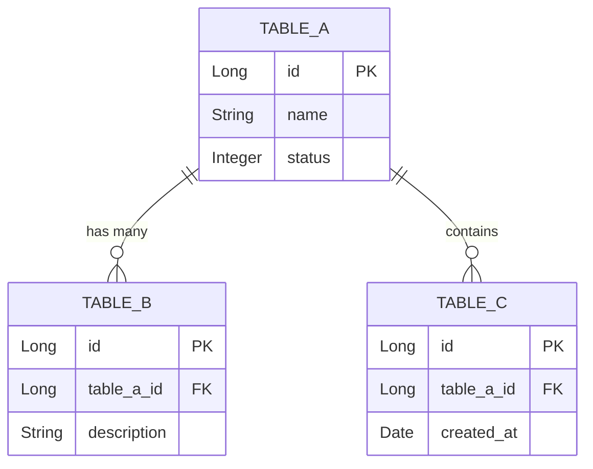

# TÀI LIỆU THIẾT KẾ CƠ SỞ DỮ LIỆU (DBD) - {{PROJECT_NAME}}

| Thông tin         | Chi tiết                 |
| :---------------- | :----------------------- |
| **Dự án**         | {{PROJECT_NAME}}         |
| **Phiên bản**     | {{VERSION}}              |
| **Ngày cập nhật** | {{DATE}}                 |
| **Trạng thái**    | {{STATUS}}               |
| **Tác giả**       | {{AUTHOR}}               |
| **Cơ sở dữ liệu** | {{DATABASE_TYPE}}        |

---

## NHẬT KÝ THAY ĐỔI
| Version | Ngày | Người sửa | Mô tả thay đổi |
| :--- | :--- | :--- | :--- |
| {{VERSION}} | {{DATE}} | {{AUTHOR}} | Phiên bản đầu tiên |
| ... | ... | ... | ... |

---

## 1. SƠ ĐỒ THỰC THỂ KẾT HỢP (ERD)

Sơ đồ ERD (Entity Relationship Diagram) mô tả các thực thể chính trong hệ thống và mối quan hệ giữa chúng (khóa chính, khóa ngoại, quan hệ 1-nhiều, nhiều-nhiều).

---

## 2. CHI TIẾT BẢNG DỮ LIỆU (TABLE DEFINITIONS)

<Mô tả chi tiết các trường dữ liệu, kiểu dữ liệu và ý nghĩa nghiệp vụ của từng bảng.>

### 2.1. <Tên_Bảng_1>
<Mô tả mục đích của bảng này. Ví dụ: Lưu trữ thông tin tài khoản người dùng>
- `id` (<Type>, PK): Khóa chính, định danh duy nhất.
- `field_name_1` (<Type>): <Mô tả trường dữ liệu>.
- `field_name_2` (<Type>, FK): <Mô tả trường>, tham chiếu tới bảng `<Tên_Bảng_Khác>`.

### 2.2. <Tên_Bảng_2>
<Mô tả mục đích của bảng này>
- `id` (<Type>, PK): Khóa chính.
- `field_name_1` (<Type>): <Mô tả trường dữ liệu>.

---

## 3. CHỈ MỤC & HIỆU NĂNG (INDEXING & PERFORMANCE)

<Tùy chọn: Định nghĩa các Index để tối ưu truy vấn cho Database>

- **<Tên_Bảng_1>**
  - Khóa phụ: `idx_table1_field2` trên trường `field_name_2` để truy vấn nhanh.
- **<Tên_Bảng_2>**
  - Khóa tìm kiếm: `idx_table2_field1` trên trường `field_name_1`.

---

END OF TEMPLATE
